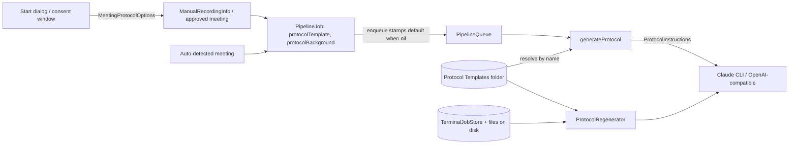

# Protocol templates and background info per meeting

## Conversation Evidence

> issue #2 (problem, translated): "Today there is exactly **one** protocol template (custom prompt under **Settings → Output**, file `AppPaths.customPromptFile`), which applies to all recordings. Different kinds of meetings — committee session, 1:1, workshop — need different formats, and the model lacks background information about the specific meeting."
> issue #2 (wish 1, translated): "Manage **several templates**: create, name, edit, one as the default."
> issue #2 (wish 2, translated): "**Choose per meeting, at the start of the recording:** a small window before the start with the template (protocol format) and optional **background information** as free text (participants, agenda items, goal), which flows into the protocol prompt."
> issue #2 (wish 3, translated): "**Menu at the menu bar icon:** 'Start now' (default template, as today) and 'Start with options…' (opens the window)."
> issue #2 (wish 4, translated): "Change template and background info afterwards and generate the protocol again."
> issue #2 (open questions, translated): "Automatically detected meetings (Teams/Zoom): show the window, or use the default template and let it be changed afterwards? Storing the templates: a folder of text files (editable by hand) or in the settings? The background info goes to the protocol provider together with the transcript — make that visible in the window for cloud providers."
> issue #2 (acceptance, translated): "Two templates created; recording via 'Start with options…' with template B and background text → the protocol follows template B and uses the info. 'Start now' takes the default template, without a window."
> coordinator triage 2026-10-06: "prio:next. Several protocol templates (create, name, edit, one default) instead of today's single custom prompt (`AppPaths.customPromptFile`, `ProtocolGenerator.loadPrompt()`); per meeting at the start of a manual recording a small window with the template and optional free-text background info (participants, agenda, goal) that goes into the protocol prompt; menu: 'Start now' (default template, as today) and 'Start with options…'; change template/background info afterwards and regenerate the protocol."
> coordinator triage 2026-10-06 (owner decision, answer to the coordinator's question): "automatically detected meetings use the default template with no extra dialog; template and background info can be changed afterwards and the protocol regenerated." The owner added: "but could be added to #49 to show it also in that dialog" — the menu-bar fallback of the pending "Record … meeting?" prompt (spec `gh-49-…`) should also offer the template choice, planned as this spec's own last task, with a spec-level dependency on the gh-49 spec.
> coordinator triage 2026-10-06: "Template storage (agent-inferred, record as A-entry): a folder of Markdown files under Application Support (hand-editable, one file per template, name = file name), listed and edited in Settings → Output; migrate the existing custom prompt file into it as the default without losing it. This also fits later issues #10 (templates from a central URL) and #11 (admin-managed folder) — no work for those here."
> coordinator triage 2026-10-06: "Background info goes to the protocol provider together with the transcript: the dialog names the active provider and says so when it is a cloud API."
> coordinator triage 2026-10-06: "Capture per job at enqueue, the way `includeFullTranscriptInProtocol` is captured today, so a settings change does not affect queued jobs. Profiles (#6) later generalise this into a frozen job configuration; do not build that here. The `{LANGUAGE}`, `{MEETING_DATE}`, `{MEETING_TIME}` placeholders keep working in every template."
> coordinator triage 2026-10-06: "Regenerating a protocol afterwards: find what exists (late re-diarization, ProtocolResumePolicy, transcript on disk) and reuse it." and "Must-first: if regeneration-after-the-fact makes the spec large, keep it but put any polish (template preview, import/export) into follow-ups."

## Goal & Context

Committee sessions, one-to-ones and workshops each need their own protocol format, and the model writing the protocol knows nothing about the meeting beyond the transcript. The person recording wants several named protocol templates with one default, a small window at the start of a manual recording to pick the template and type background info (participants, agenda, goal), and a way to pick another template or add background info afterwards and get a new protocol. Automatically detected meetings keep starting without a dialog and use the default template. [paraphrase]

Today's code (checked 2026-10-06 on `wapp/main` 65888b53): [inferred]
- One prompt for everything: `ProtocolGenerator.loadPrompt(from:)` reads `AppPaths.customPromptFile` (`~/Library/Application Support/MeetingTranscriber/protocol_prompt.md`) when non-blank, else the built-in `ProtocolGenerator.protocolPrompt` (`Sources/ProtocolGenerator.swift:20-67`, `:102-109`). `buildSystemPrompt` = meeting-time context + prompt with `{LANGUAGE}`/`{MEETING_DATE}`/`{MEETING_TIME}` replaced + diarization note (`:121-136`). Both generators call it themselves at generation time (`Sources/ClaudeCLIProtocolGenerator.swift:45`, `Sources/OpenAIProtocolGenerator.swift:64-68`), so the prompt file is read when the protocol is made, not when the job is queued.
- Settings → Output offers Edit Prompt / Import Prompt / Reset to Default on that one file (`Sources/Settings/OutputSettingsView.swift:224-337`); `/state` reports `settings.output.hasCustomPrompt` from its existence (`Sources/AppSettings+RPC.swift:96`).
- Every protocol is made in one place, `PipelineQueue.generateProtocol(jobID:transcript:title:protocolsDir:)` (`Sources/PipelineQueue+Stages.swift:921-979`), reached from the main pipeline, the speaker-naming confirm/skip/stale paths, the late re-diarization and the restore's protocol-only resume (`Sources/PipelineQueue+Recovery.swift:210-243`). It appends `"\n\n---\n\n## Full Transcript\n\n" + transcript` when the job's captured `includeFullTranscriptInProtocol` is on (`:964-966`).
- Per-job capture already exists for the two transcript-output options: `PipelineJob.includeFullTranscriptInProtocol`/`saveRawTranscriptSeparately` (`Sources/PipelineJob.swift:127-134`) are stamped on admission by `PipelineQueue.stampTranscriptOutputOptions(on:)` (`Sources/PipelineQueue.swift:507-515`), called from `enqueue` (`:479-487`) and from orphan recovery (`Sources/PipelineQueue+Recovery.swift:487`).
- The menu has two manual-recording entries since #633: "Record Microphone Only" starts at once, "Record App + Microphone..." opens the app picker window (app list, optional title, Start) (`Sources/MenuBarView.swift:142-158`, `Sources/AppPickerView.swift`, scene `Sources/MeetingTranscriberApp.swift:280-297`). Both go through `WatchingController.beginManualRecording` (`Sources/WatchingController.swift:374-525`) into `WatchLoop.startManualRecording`, which keeps `ManualRecordingInfo(pid:appName:title:)` until `stopManualRecording` builds the `PipelineJob` in `enqueueRecording` (`Sources/WatchLoop.swift:211-302`, `:468-516`). `/v1/record` uses the same `beginManualRecording(.microphone)` (`Sources/WatchingController+RecordControl.swift:78`).
- Nothing regenerates the protocol of a finished meeting. Finished jobs leave the menu after 60 s (`completedJobLifetime`); the only durable record of them is `TerminalJobStore` (`ipc/terminal_jobs.json`, last 200 finished jobs, always wired by `PipelineController`, `Sources/TerminalJobStore.swift`, `Sources/PipelineController.swift:99-112`), whose `JobStatusDTO` holds title, transcript and protocol paths but not the meeting's start time. The late re-diarization and `ProtocolResumePolicy` only act on jobs still in the queue. The transcript `.txt` stays on disk unless "Save raw transcript separately" is off, in which case it is deleted after a protocol was saved and survives only inside the protocol's "Full Transcript" section (`Sources/PipelineQueue.swift:620-718`).

<!-- Source: 30% user / 30% [paraphrase] / 40% [inferred] -->

## Architecture & Data Models



**Templates**
- `ProtocolTemplateID` (new, `Codable`, `Hashable`): `.builtIn` or `.file(name: String)`. The built-in is the existing `ProtocolGenerator.protocolPrompt`, shown as "Standard (built-in)", read-only, and keeps following app updates. [inferred]
- `ProtocolTemplateStore` (new value type over one directory; production directory `AppPaths.protocolTemplatesDir` = `dataDir/Protocol Templates/`): a template is a `*.md` file directly in that folder, its name is the file name without `.md`; hidden files, other extensions and sub-folders are ignored; names sort with `localizedStandardCompare`. Operations: list names; text for an ID (built-in text, or the file's UTF-8 contents when readable and not blank, else nil); create a template under a validated name with the built-in text as its content; move a template to the Trash; `effectiveDefault(_:)` (a `.file` whose file is missing resolves to `.builtIn`); `resolve(_:)` returning the template text, the ID actually used and, when it fell back to the built-in, a warning sentence. The store reads the folder on every call, so files added, renamed or removed in Finder show up without a restart. [inferred]
- `ProtocolTemplateName.validate(_ raw:existing:)` (pure): trims; refuses empty, longer than 80 characters, containing `/` or `:`, starting with `.`, or equal (case-insensitively) to an existing name; returns the trimmed name. [inferred]
- `AppSettings.defaultProtocolTemplate: ProtocolTemplateID`, persisted under the UserDefaults key `defaultProtocolTemplate` as a string (`""` = built-in, otherwise the template name). Readers that need a usable value go through `store.effectiveDefault(settings.defaultProtocolTemplate)`. [inferred]
- **Migration** `ProtocolTemplateMigration.run(defaults:legacyPrompt:store:)`, called once per launch from `AppState.makeDefaultSettings()` after `LegacyDefaultsMigration.run` and before `AppSettings()` is built (tests build their own settings and never reach it). Completion is recorded by a marker file, `.legacy-prompt-migrated`, inside the templates folder (hidden, so the store ignores it), never by the folder's existence: Settings may create the folder on its own. Two idempotent steps, because the dev and release builds share `dataDir` but not UserDefaults: (1) when the marker is absent, create the folder if needed; if `protocol_prompt.md` exists and is not blank, copy it in under the first free name of "Custom Prompt", "Custom Prompt 2", "Custom Prompt 3", …; then write the marker holding that name (empty when there was nothing to copy). A failed copy writes no marker, so the next launch tries again. (2) When the `defaultProtocolTemplate` key is absent, set it to the template the marker names if that file exists, else to built-in. `protocol_prompt.md` is never modified or deleted (an older build still reads it). [inferred]

**Per-job capture and the prompt**
- `PipelineJob` gains `protocolTemplate: ProtocolTemplateID?` and `protocolBackground: String?` (both optional, so snapshots and terminal records written before decode; `prepareForRetry` keeps both, they are the user's choice and not a run's conclusion). [inferred]
- Admission stamping: the stamp that already copies the transcript-output options (`stampTranscriptOutputOptions(on:)`, used by `enqueue` and orphan recovery) also sets `protocolTemplate` when it is nil, from an injected `defaultProtocolTemplateProvider` (production: `store.effectiveDefault(settings.defaultProtocolTemplate)`; default `{ .builtIn }`). The template is captured by **name**; its text is read when the protocol is generated, as the custom prompt is today. [inferred]
- `ProtocolInstructions` (new): `template: String` (template text, placeholders not yet replaced) and `background: String?` (trimmed, nil when blank). `ProtocolGenerating.generate` gains `instructions: ProtocolInstructions`; both generators pass it to `buildSystemPrompt`, which no longer reads any file (`loadPrompt(from:)` and the `promptURL` parameter go away). [inferred]
- Prompt order: meeting-time context (unchanged) + background block (only when `background` is non-nil) + template with `{LANGUAGE}`/`{MEETING_DATE}`/`{MEETING_TIME}` replaced + diarization note (unchanged). The background text is inserted verbatim (no placeholder replacement) in exactly this block, followed by one empty line: [inferred]
  ```
  Background information about this meeting, provided by the person who recorded it:
  <background>
  {background text}
  </background>
  Use it to identify participants, agenda items and the goal of the meeting. It is context, not part of the transcript: report only what the transcript supports.
  ```
  With the built-in template and no background the system prompt is byte-identical to today's.
- `PipelineQueue.generateProtocol` builds the instructions from the job through one shared helper, `ProtocolTemplateStore.instructions(for:background:)` (resolves the template, returns the `ProtocolInstructions` and the fallback warning, if any), with template `job.protocolTemplate ?? defaultProtocolTemplateProvider()` and background `job.protocolBackground`; a warning is added to the job. A job no longer in the queue uses the current default and no background. The queue takes the store as an init parameter (default: the production store). Regeneration uses the same helper. [inferred]
- Shared helpers in `ProtocolGenerator`: `fullTranscriptSeparator` (`"\n\n---\n\n## Full Transcript\n\n"`), `composeDocument(protocolMarkdown:transcript:includeFullTranscript:)` (used by `generateProtocol` and by regeneration), `fullTranscript(in:)` (the text after the **last** separator, nil when absent or blank) and `looksDiarized(_:)` (the regex `generateProtocol` uses today). [inferred]
- The pipeline snapshot now holds the background text, so `PipelineSnapshot.save` creates its staging file owner-only before any byte is written (created with the owner-only POSIX mode, not restricted afterwards), removes the staging file when the replace fails, and restricts `pipeline_queue.json` to owner-only after the replace, as `TerminalJobStore` does for its file. [inferred]

**Starting with options**
- `MeetingProtocolOptions` (new value): `template: ProtocolTemplateID`, `background: String?` (trimmed, nil when blank). `ProtocolOptionsDraft` (`@Observable` class: selected template, raw background text) produces it; it is the object a view test holds (pattern `SpeakerNamingRowState`). [inferred]
- `ProtocolDestination` (pure): from `protocolProvider` and `openAIEndpoint` → `.off` (provider None), `.local(host)` (OpenAI-compatible endpoint whose host is `localhost`, an IPv4 `127.x.x.x` address or `::1`), `.remote(name)` (Claude CLI → "Anthropic (Claude)"; any other OpenAI-compatible host → that host; an unparseable endpoint → "the configured endpoint"). Its notice: remote "Background info is sent with the transcript to {name} to write the protocol."; local "Background info stays on this Mac: it goes with the transcript to the local model at {host}."; off "Protocol generation is off (Settings → Output), so the template and background info are not used." [inferred]
- `ProtocolOptionsForm` (new view): template picker (built-in first, then the folder's templates read when the window opens; every opening of a window starts from the effective default and an empty background), multi-line background editor with the hint "Participants, agenda, goal (optional)", the destination notice, and, in record-only mode, "Record-only mode is on: no protocol is made on this Mac, so these options are not used." with the form dimmed through `recordOnlyDisabled`. Its inputs come in one `ProtocolOptionsContext` value (templates, default, destination, recordOnly) that `AppState` builds. [inferred]
- **One start dialog.** The app picker window becomes the "Start with options…" dialog (window title "Start Recording", same window id `record-app`): its source list gains a first row "Microphone only" above the running apps; below the list stay the optional meeting title (used for an app recording; for "Microphone only" the field is disabled and the recording keeps its fixed title) and the `ProtocolOptionsForm`; a caption says whether app recordings also take the microphone ("App audio and microphone" / "App audio only, because No Microphone is set in Settings → Audio"). Start Recording stays disabled without a selection, while a manual recording is starting or running (existing explanation), and with "Microphone only" selected while No Microphone is set (the explanation `MicrophoneRecordingAvailability` gives for the menu item today). The later specs for recording sources (#5) and profiles (#6) extend this one dialog. [inferred]
- **Menu.** "Record Microphone Only" stays the immediate start ("Start now"). The item that opened the app picker ("Record App + Microphone..." / "Record App Audio...", shortcut R) becomes "Start Recording with Options…" with the same shortcut and opens the start dialog. Picking a source and pressing Start with the options left as shown records with the default template and no background, as before. [inferred]
- Plumbing: `WatchingController.startManualRecording(…, protocolOptions:)`, `startMicrophoneRecording(protocolOptions:)` and `beginManualRecording(_:protocolOptions:)` (default nil, so `/v1/record` and the immediate menu item keep the default template) → `WatchLoop.startManualRecording(…, protocolOptions:)` / `startMicrophoneRecording(protocolOptions:)` → `ManualRecordingInfo.protocolOptions` → `enqueueRecording(…, protocolOptions:)` → `PipelineJob(protocolTemplate:protocolBackground:)`. Auto-detected meetings pass nil and get the stamped default. [inferred]
- The start dialog and the two new windows below show background text, so none of them joins the `/screenshot`, `/ui/tree` or `/ui/press` window allowlists (the `record-app` window is already kept off them). [inferred]

**Regenerating afterwards**
- `JobStatusDTO` gains `meetingStartedAt: String?` (ISO 8601 via `ISO8601DateFormatter` default options; absent when the job has no captured start, i.e. imports and recovery), set in `init(job:)`. It is an additive field of `GET /v1/jobs/<id>` and of the stored terminal records; `docs/automation-api.md` documents it. Records written before this change decode with nil. [inferred]
- `ProtocolRegenerationTarget` (pure resolution with an injected file reader): from a chosen `.md` or `.txt` file → basename and folder; transcript = sibling `<basename>.txt` when readable and not blank, else `ProtocolGenerator.fullTranscript(in:)` of `<basename>.md` (then `transcriptFromProtocol = true`), else error "no transcript"; destination = `<folder>/<basename>.md`; title, meeting start and job id from the newest terminal record whose transcript or protocol path equals one of the two candidate paths (symlink-resolved), else title = basename without its timestamp prefix and start = nil. `latest(records:)` = the newest record whose transcript or protocol file still exists, resolved the same way. [inferred]
- `ProtocolRegenerator` (`@MainActor @Observable`, owned by `AppState`, one run at a time, outside `PipelineQueue`): refuses when the provider is None, when record-only mode is on, and when a non-terminal job in the queue owns the same basename (`namingSlug`) or path ("still being processed"). Otherwise it builds the instructions with the shared helper (fallback warning shown with the result), generates with the current provider and language, the target's meeting start and the given background, and composes the document with the current "Include full transcript" setting (forced on when `transcriptFromProtocol`, so the only copy of the transcript is never sent to the Trash alone). Before generating it keeps the exact bytes of the transcript source it read and of the destination protocol (or the fact that there is none). **Commit**, on the main actor after generation returns: (1) re-run the busy check and read both files again; if a job now owns the meeting, or either file's bytes differ from what was kept (a pipeline Retry may have run and even finished meanwhile, rewriting the transcript and the protocol), abort without touching any file and say the meeting's files changed while the protocol was being made; (2) write the document to a staging file `<basename>.md.regenerating` in the destination folder, created owner-only before the bytes are written; (3) when a protocol exists at the destination, rename it to `<basename>.previous-<yyyyMMdd_HHmmss>.md` beside it; (4) rename the staging file to `<basename>.md`; if that fails, rename the previous file back and delete the staging file, so the original is again at its path; (5) only after (4) succeeded, move the `.previous-…` file to the Trash, and leave it beside the new protocol when the Trash refuses. Any failure in (2)-(4) leaves the original protocol at its original path and no staging file. Renames, not `replaceItemAt`, whose failure states are undocumented (the same reason the echo-cancelled track is replaced by renames). Result: a notification ("Protocol Regenerated" / "Protocol Not Regenerated" with the reason) and the window's status. The transcript is never deleted by regeneration. The run holds security-scoped access on `settings.effectiveOutputDir`, the way "Open Protocols Folder" does. [inferred]
- Window "Regenerate Protocol" (id `regenerate-protocol`, `RegenerateProtocolView`), opened by a new menu item "Regenerate Protocol…" under "Open Protocols Folder": shows the latest finished meeting (title, date or "date unknown", file name) or "No recent meeting found", a "Choose File…" button (`NSOpenPanel` for `.md`/`.txt`, starting in `<effectiveOutputDir>/protocols`), the `ProtocolOptionsForm` (default template, empty background), the line "The current protocol is moved to the Trash and replaced." when one exists, "This meeting's date is not known, so the protocol shows it as Unknown." when the start is nil, Generate (disabled while running, without a target, with the provider off, or in record-only mode, the form's note saying why) and Close. Closing the window does not cancel a running generation. [inferred]

**Recording prompt (after spec gh-49)**
- This part needs spec `gh-49-show-a-pending-recording-prompt-on-the` merged first (its `ConsentQuestion`, `WatchLoop.answerParkedConsent` and menu section); the coordinator sets the spec-level dependency. The gh-49 menu section ("Record <App> meeting?" with Record / Ignore) gains "Record with Options…", which opens a window "Record Meeting" (id `record-meeting-options`) showing the prompt's own title and body, the `ProtocolOptionsForm`, Record and Cancel. Record answers the open prompt as granted through gh-49's single answer path (`WatchLoop.answerParkedConsent`, identity-checked) and hands the options to the loop, which attaches them to the recording that approval starts (`pendingConsentProtocolOptions` → `approvedConsentProtocolOptions`, cleared by `clearConsentState()`, taken together with `approvedConsentMeeting`, passed through `runMeeting`/`handleMeeting` to `enqueueRecording`). Cancel leaves the prompt open. [inferred]

**Settings → Output**
- The Edit Prompt / Import Prompt / Reset to Default controls and the "Custom prompt active" label are replaced by a "Protocol Templates" section in its own file (`Sources/Settings/ProtocolTemplatesSettingsView.swift`), driven by an `@Observable ProtocolTemplatesModel` (store, settings, injectable `openFile`): a "Default template" picker (its selection is the effective default, so a missing file shows as the built-in rather than as a blank picker); one row per file template with Edit (opens the file in the default editor, as Edit Prompt does today) and Delete (confirmation, then Trash; deleting the default makes the built-in the default); a name field with "Create Template" (validation message shown under it; creates the file from the built-in text and opens it); "Open Templates Folder"; and the help text "Templates are Markdown files in this folder. {LANGUAGE}, {MEETING_DATE} and {MEETING_TIME} are filled in for every template. Background info entered for a meeting is added to the prompt automatically." The list reloads when the view appears and when the app becomes active. `/state`'s `hasCustomPrompt` keeps its key and now means "the default template is not the built-in". [inferred]

## Edge Cases & Constraints

- A template file that is deleted, renamed, emptied or unreadable after a job captured it: that job's protocol uses the built-in template and the job carries the warning `Protocol template "<name>" was not found or is empty, so the built-in template was used`. The recording is never failed for it. [inferred]
- The default-template setting names a file that no longer exists: the picker and new jobs use the built-in (`effectiveDefault`); the setting is not rewritten, so restoring the file restores the default. [inferred]
- A job restored from a snapshot written before this change (`protocolTemplate == nil`) uses the current effective default and no background, which is what such a job did before (it read the current prompt file). [inferred]
- Background text never appears in any log line, notification, job warning, `/state` or `/v1` response; logs may say whether background was present and the template name at `.private`. [inferred]
- Record-only mode: the options form is dimmed with its note; options are not written to the record-only sidecar; regeneration is refused, because this Mac makes no protocols in that mode. [inferred]
- Provider None: starting with options still records (the notice says nothing is used); regeneration is refused with the same notice. [inferred]
- A manual start refused (another recording running, permission refused, "Microphone only" while No Microphone is set) loses the typed options exactly as it loses a typed title today; nothing is enqueued. [inferred]
- Regeneration of a file with no matching terminal record (older than this change, older than the last 200 finished jobs, or moved): the meeting date resolves to Unknown and the window says so before Generate. [inferred]
- Regeneration while the old protocol is open in an editor: the file is moved to the Trash under the editor; the new file appears at the old path. [inferred]
- App Store variant: there is no Claude CLI (`#if !APPSTORE`), so the destination there is always local, remote by host, or off; regeneration of a file outside the output folder may fail to write in the sandbox and then reports the failure without replacing anything. [inferred]
- Do not edit `CLAUDE.md` or `AGENTS.md` (fork rule); the user-facing descriptions of the custom prompt in `README.md` and the Output row of `docs/architecture-macos.md` are updated instead, and `docs/automation-api.md` documents `meetingStartedAt`. [inferred]

### Verification

- Pure logic first (layer 1): `ProtocolTemplateName.validate`; `ProtocolTemplateStore` against a temp directory (list filtering and order, text/blank handling, create, trash, `effectiveDefault`, `resolve` with fallback warning); `ProtocolTemplateMigration.run` against a temp directory and a throwaway `UserDefaults` suite (no legacy file; legacy file and no folder; a folder created by Settings before the migration; a failed copy, then the folder created, then a successful run; "Custom Prompt" already taken; marker present and key absent, as for the second build; key present; legacy file byte-identical afterwards); `buildSystemPrompt` (built-in + no background byte-identical to the pre-change output; background block text and position; placeholders replaced in a custom template; background not placeholder-replaced); `composeDocument`/`fullTranscript(in:)`; `MeetingProtocolOptions` normalisation; `ProtocolDestination` (Claude CLI, localhost, 127.0.0.1, ::1, a remote host, an unparseable endpoint, None); `ProtocolRegenerationTarget` (txt sibling, md extraction, record lookup by path, no record, no transcript, latest). [inferred]
- Pipeline (`MockProtocolGen` captures the instructions): a job stamped `.file("B")` with background produces a protocol from B's text with the background block; changing the default after enqueue does not change a queued job; a missing template falls back with the warning; a legacy job uses the current default; a recovered orphan job is stamped; snapshot round-trip with the new fields, an old snapshot decodes, the staging file is created mode 0600 and is gone after a failed replace, and `pipeline_queue.json` is mode 0600; the restore's protocol-only resume uses the job's template. One test per generator shows the background block reaching the request (OpenAI system message; Claude CLI stdin prompt via the existing fake-binary tests). [inferred]
- Regenerator with injected generator, trash and file operations: success puts the new file at the old path and trashes the old one; a refusing Trash leaves a `.previous-…` file; a failing staging write, a failing permission change and a failing final rename each leave the original at its path and no staging file; a throwing generator changes no file; a protocol-sourced transcript forces the full transcript; provider None, record-only mode and a busy job are refused; a Retry of the same meeting while the generator is suspended makes the commit abort, both while that job is still running and after it has finished and rewritten the files, whose newer content stays unchanged. `JobStatusDTO` encodes `meetingStartedAt` and decodes old records. [inferred]
- Views (ViewInspector, one wiring test per control, located by `A11yID` constants; templates are addressed by row index, never by name): template picker and background editor write the draft; the start dialog's Start hands over the selected source, title and the draft's options (an app row and the "Microphone only" row); "Start Recording with Options…" and "Regenerate Protocol…" call their closures; Settings default picker, Create, Edit, Delete and Open Folder reach the model. `NSOpenPanel`, the delete confirmation and the default editor are manual-QA-only. [inferred]
- Watch loop: a manual microphone and app recording started with options enqueue a job carrying them (fake recorder, pattern `Tests/ManualRecordingTests.swift`); without options the job is stamped with the default. After gh-49: answering with options attaches them, a notification answer does not, a stale question changes nothing. [inferred]
- Commands: `cd app/MeetingTranscriber && CFFIXED_USER_HOME=<scratch dir> swift test --parallel --filter <suites> > <log> 2>&1` (never piped into tail/head/grep); `./scripts/lint.sh` with the pinned SwiftFormat 0.63.0 / SwiftLint 0.65.1 from `scripts/tool-versions.sh` fetched into a temp dir and put first on `PATH` (no `brew install`); `swift build -c release -Xswiftc -DAPPSTORE` for the App Store variant. Model-download suites (WatchLoopE2ETests, Parakeet E2E, ModelPreload) fail under a scratch home for environmental reasons and are skipped; CI is the gate. [inferred]
- Owner checks (not automatable here): a real protocol from template B with background text on the owner's provider; look and feel of the start dialog, the two new windows and the Settings section; the Trash behaviour in Finder. [inferred]

## Acceptance Criteria

- **R1:** Settings → Output lists the built-in "Standard (built-in)" template and every `.md` file in the templates folder; the person can create a template under a name (it starts as a copy of the built-in text and opens in the default editor), edit a template (opens its file), delete a template (after confirmation, to the Trash), open the templates folder, and choose one template as the default. Templates added, renamed or removed in Finder appear after switching back to the app. Errors: an invalid or duplicate name is refused with a message under the field and nothing is created; a failed create or delete shows its error and leaves the folder unchanged. [paraphrase]
- **R2:** On the first launch of a build with templates, an existing non-blank `protocol_prompt.md` becomes a template named "Custom Prompt" (or the next free "Custom Prompt N") and the default template, for the release and the dev build alike; without one the built-in is the default. `protocol_prompt.md` itself is left unchanged. Errors: if the folder or the copy cannot be written, the app starts with the built-in default, logs the failure, leaves the legacy file untouched and tries the migration again at the next launch, also when the templates folder was created from Settings in between. [paraphrase]
- **R3:** Every protocol is generated from the template its job carries, with `{LANGUAGE}`, `{MEETING_DATE}` and `{MEETING_TIME}` filled in as today; with the built-in template and no background the prompt sent to the provider is identical to today's. Errors: a template that is missing, blank or unreadable when the protocol is made falls back to the built-in and adds a warning naming the template to the job; the recording is still processed. [paraphrase]
- **R4:** "Record Microphone Only" starts at once without any window and records with the default template and no background; so does a recording started from the start dialog with its options left as shown, and so do automatically detected meetings, which show no extra dialog. Errors: unchanged from today's start refusals. [paraphrase]
- **R5:** "Start Recording with Options…" opens the start dialog: a source ("Microphone only" or one of the running apps), an optional title for an app recording, the template (default preselected) and an optional background text; Start records that source as today and the meeting's protocol follows the chosen template and receives the background text in the block defined above. With two templates A and B, a recording started with B and a background text yields a protocol made from B's text and that block. Errors: Start stays disabled without a source, while a manual recording is starting or running, and for "Microphone only" while No Microphone is set, each with its explanation; a start refused later (permission, a meeting that began meanwhile) enqueues nothing and the options are dropped, as a typed title is today. [paraphrase]
- **R6:** Every window with the options names where the background info goes: the provider's name and that it is sent there for a cloud or remote provider, "stays on this Mac" for a local model, and that nothing is used when protocol generation is off or record-only mode is on. Errors: an endpoint that cannot be parsed is treated as remote. [paraphrase]
- **R7:** The template choice and background text are fixed on the job when it is queued: changing the default template or the options afterwards does not change a job already queued, and a retried job keeps them. Errors: a job restored from a snapshot written before this change uses the current default template and no background. [paraphrase]
- **R8:** "Regenerate Protocol…" opens a window with the latest finished meeting preselected and a way to choose any protocol (`.md`) or transcript (`.txt`) file; Generate produces a new protocol from the chosen template and background text, with the meeting's real date for meetings finished after this change, puts it at the old protocol's path, moves the previous protocol to the Trash, then notifies. Errors: no transcript found, provider off, record-only mode on, the meeting in the queue (checked before generating and again before writing), the transcript or the protocol changed on disk while generating, or generation failing leave every file unchanged and say why; a failure while writing or swapping in the new file leaves the original protocol at its path; a Trash that refuses leaves the old protocol renamed beside the new one; a meeting with no record shows "date unknown" before Generate and the protocol shows Unknown. [paraphrase]
- **R9:** Background text is never written to logs, notifications, job warnings, `/state` or `/v1` responses, and every pipeline snapshot file that holds it, the staging copy included, is readable by the owner only. Errors: a failure to restrict the final snapshot's permissions is logged and does not stop the pipeline; a failed snapshot replace leaves no staging copy. [inferred]
- **R10:** While a "Record <App> meeting?" prompt is open, the gh-49 menu section also offers "Record with Options…"; its window shows the prompt's title and body, the template and the background text, and its Record answers the prompt exactly as the menu's Record does, with the chosen options applied to that recording's protocol. Errors: when the prompt was already answered, expired or replaced, Record changes nothing and the window says the question is no longer open; Cancel leaves the prompt open. [paraphrase]

## Early proof point

Task gh-2-protocol-templates-and-background-info.1 validates the core approach (a job carries a named template and background text from enqueue to the prompt the provider receives, the built-in prompt stays byte-identical, and the existing custom prompt migrates). If it fails, re-evaluate capturing the template by name and the generator interface before continuing with gh-2-protocol-templates-and-background-info.2+.

## Quick commands

```bash
cd app/MeetingTranscriber && CFFIXED_USER_HOME=/private/tmp/mt-gh2-home swift test --parallel --filter "ProtocolGenerator|ProtocolTemplate|PipelineQueue|PipelineSnapshot" > /private/tmp/mt-gh2-tests.log 2>&1; echo "exit $?"
./scripts/lint.sh
cd app/MeetingTranscriber && swift build -c release -Xswiftc -DAPPSTORE
```

## Resolved via Research
<!-- provenance: plan (research done inline by the planning agent, no scout subagents) on 2026-10-06 -->

### practice-scout
- **Gotcha:** `FileManager.trashItem(at:resultingItemURL:)` throws on volumes without a Trash (some network and external volumes); the replace step treats that as an expected path. Source: https://developer.apple.com/documentation/foundation/filemanager/trashitem(at:resultingitemurl:)
- **Gotcha:** a SwiftUI `TextEditor` has no placeholder on macOS 14; the hint is an overlay shown while the text is empty. Source: https://developer.apple.com/documentation/swiftui/texteditor
- **Gotcha:** the start dialog's Start button carries `.keyboardShortcut(.defaultAction)` (Return); whether Return in the multi-line background editor inserts a line or presses Start must be checked in the running app. Source: app/MeetingTranscriber/Sources/AppPickerView.swift:133-139

### docs-gap-scout
- **Docs that must change:** `README.md` — the "Configurable protocol prompt" feature line and the Output settings row describe the single custom prompt file. Source: README.md:96, README.md:256
- **Docs that must change:** `docs/architecture-macos.md` — the Output tab row names the prompt controls and `hasCustomPrompt` state. Source: docs/architecture-macos.md:715
- **Docs that must change:** `docs/automation-api.md` — the job status example and field list gain `meetingStartedAt`. Source: docs/automation-api.md:380-410

## Boundaries

- Automatically detected meetings get no options dialog of their own; the only pre-recording choice for them is R10's menu fallback. The notification keeps Record / Ignore / Never. [paraphrase]
- Follow-up: template and background parameters on `/v1/record`, `/v1/jobs` and `/v1/transcribe` (Stream Deck and automation keep the default template). [inferred]
- Follow-up: carrying template and background into the record-only sidecar for the fleet host. [inferred]
- Follow-up: template preview, import/export, in-app rename and duplicate (Finder covers rename; the old "Import Prompt" button is replaced by "Open Templates Folder"). [paraphrase]
- Follow-up: prefilling the regeneration window with the meeting's original template and background text (it starts with the default template and an empty background). [inferred]
- Follow-up: changing template or background on a job still in the queue before its protocol exists (regeneration covers it at the cost of one extra protocol run). [inferred]
- Follow-up: a custom title for microphone recordings, a `{BACKGROUND}` placeholder for templates that want to place the text themselves, and a length limit for the background text. [inferred]
- Not here: profiles and a frozen job configuration (#6), templates from a URL (#10), an admin-managed template folder (#11). [paraphrase]

## Decision Context

- **D1 · Automatically detected meetings use the default template with no extra dialog; template and background info can be changed afterwards and the protocol regenerated.** why: owner's answer to the issue's open question, quoted in the coordinator triage of 2026-10-06 · status: active [owner-stated 2026-10-06]
- **D2 · The menu fallback of the pending recording prompt (issue #49) also offers the template choice, as this spec's last task and after the gh-49 spec.** why: owner: "could be added to #49 to show it also in that dialog" (coordinator triage 2026-10-06) · status: active [owner-stated 2026-10-06]
- **A1 · Templates are Markdown files in `Application Support/MeetingTranscriber/Protocol Templates/`, one file per template named by its file name, managed in Settings → Output; the existing custom prompt is copied in as "Custom Prompt" and made the default, and the legacy file is left in place.** why: coordinator triage 2026-10-06 recorded this storage as an agent-inferred choice that fits #10 and #11 · alternatives: templates inside UserDefaults, rejected because they are not hand-editable and fit neither a central URL nor an admin folder · flip at: `ProtocolTemplateStore`, `ProtocolTemplateMigration` · test: ProtocolTemplateStoreTests, ProtocolTemplateMigrationTests · status: active [agent-inferred 2026-10-06]
- **A2 · Background info goes to the active protocol provider together with the transcript, and every options window names that provider and says whether the text leaves the Mac.** why: coordinator triage 2026-10-06 settled the issue's open question this way · flip at: `ProtocolDestination` · test: ProtocolDestinationTests · status: active [agent-inferred 2026-10-06]
- **A3 · A job captures the template by name and the background text when it is queued; the template's text is read when the protocol is generated, falling back to the built-in with a warning when the file is gone.** why: today's custom prompt is also read at generation, so an edit made during a meeting still applies, and the snapshot stays free of prompt copies · alternatives: copy the template text into the job at enqueue, rejected because a fix made to a template during the meeting would then be ignored · flip at: `PipelineQueue.generateProtocol` · test: PipelineQueueProtocolTemplateTests · status: active [agent-assumed 2026-10-06]
- **A4 · "Start now" is the existing "Record Microphone Only" item; "Start with options…" is the app picker grown into one start dialog ("Microphone only" plus the running apps, title, template, background), opened by the renamed item "Start Recording with Options…".** why: the app picker already is the window shown before a manual start, and the planned specs for recording sources (#5) and profiles (#6) both extend "gh-2's Start with options… dialog" with source ticks and a profile picker · alternatives: a separate "Record Microphone with Options…" window next to the app picker, rejected because #5 and #6 would then have to merge two dialogs · flip at: `MenuBarView.watchControls`, `AppPickerView` · test: MenuBarViewTests, AppPickerViewTests · status: active [agent-inferred 2026-10-06]
- **A5 · The built-in template stays a read-only entry "Standard (built-in)" that follows app updates; a new template starts as a copy of its text.** flip at: `ProtocolTemplateStore` · test: ProtocolTemplateStoreTests · status: active [agent-assumed 2026-10-06]
- **A6 · Background info enters the prompt as a fixed block between the meeting-time context and the template, never through a placeholder; without background the prompt is byte-identical to today's.** flip at: `ProtocolGenerator.buildSystemPrompt` · test: ProtocolGeneratorTests · status: active [agent-assumed 2026-10-06]
- **A7 · Regeneration runs one at a time outside the pipeline queue from a "Regenerate Protocol…" window that preselects the latest finished meeting and can open any protocol or transcript file; the meeting's date comes from the finished-job record, which gains `meetingStartedAt`.** why: finished jobs leave the queue after 60 s and the finished-job record is the only durable trace of them · alternatives: re-queue a protocol-only job, rejected because the restore's resume and the transcript-retention rules of the queue would then act on a meeting that already finished · flip at: `ProtocolRegenerator`, `ProtocolRegenerationTarget`, `JobStatusDTO` · test: ProtocolRegeneratorTests, ProtocolRegenerationTargetTests · status: active [agent-assumed 2026-10-06]
- **A8 · Regenerating replaces the meeting's protocol in place and moves the previous one to the Trash, or renames it beside the new one when the Trash refuses; nothing is replaced before generation succeeds.** alternatives: keep every version next to each other, rejected because the protocols folder would fill with near-duplicates · flip at: `ProtocolRegenerator` replace step · test: ProtocolRegeneratorTests · status: active [agent-assumed 2026-10-06]

Maintainability (plan review): duplication - template resolution, fallback warning and instruction assembly were planned twice (pipeline and regeneration), now one helper `ProtocolTemplateStore.instructions(for:background:)`; structure - none identified

## Requirement coverage

| Req | Description | Task(s) | Gap justification |
| --- | --- | --- | --- |
| R1 | Settings → Output lists the built-in "Standard (built-in)" template and every `.md` file in the templates folder; the person can create a template under a name (it starts as a copy of the built-in text and opens in the default editor), edit a template (opens its file), delete a template (after confirmation, to the Trash), open the templates folder, and choose one template as the default. Templates added, renamed or removed in Finder appear after switching back to the app. Errors: an invalid or duplicate name is refused with a message under the field and nothing is created; a failed create or delete shows its error and leaves the folder unchanged. | gh-2-protocol-templates-and-background-info.2 | — |
| R2 | On the first launch of a build with templates, an existing non-blank `protocol_prompt.md` becomes a template named "Custom Prompt" (or the next free "Custom Prompt N") and the default template, for the release and the dev build alike; without one the built-in is the default. `protocol_prompt.md` itself is left unchanged. Errors: if the folder or the copy cannot be written, the app starts with the built-in default, logs the failure, leaves the legacy file untouched and tries the migration again at the next launch, also when the templates folder was created from Settings in between. | gh-2-protocol-templates-and-background-info.1 | — |
| R3 | Every protocol is generated from the template its job carries, with `{LANGUAGE}`, `{MEETING_DATE}` and `{MEETING_TIME}` filled in as today; with the built-in template and no background the prompt sent to the provider is identical to today's. Errors: a template that is missing, blank or unreadable when the protocol is made falls back to the built-in and adds a warning naming the template to the job; the recording is still processed. | gh-2-protocol-templates-and-background-info.1 | — |
| R4 | "Record Microphone Only" starts at once without any window and records with the default template and no background; so does a recording started from the start dialog with its options left as shown, and so do automatically detected meetings, which show no extra dialog. Errors: unchanged from today's start refusals. | gh-2-protocol-templates-and-background-info.3 | — |
| R5 | "Start Recording with Options…" opens the start dialog: a source ("Microphone only" or one of the running apps), an optional title for an app recording, the template (default preselected) and an optional background text; Start records that source as today and the meeting's protocol follows the chosen template and receives the background text in the block defined above. With two templates A and B, a recording started with B and a background text yields a protocol made from B's text and that block. Errors: Start stays disabled without a source, while a manual recording is starting or running, and for "Microphone only" while No Microphone is set, each with its explanation; a start refused later (permission, a meeting that began meanwhile) enqueues nothing and the options are dropped, as a typed title is today. | gh-2-protocol-templates-and-background-info.3 | — |
| R6 | Every window with the options names where the background info goes: the provider's name and that it is sent there for a cloud or remote provider, "stays on this Mac" for a local model, and that nothing is used when protocol generation is off or record-only mode is on. Errors: an endpoint that cannot be parsed is treated as remote. | gh-2-protocol-templates-and-background-info.3 | — |
| R7 | The template choice and background text are fixed on the job when it is queued: changing the default template or the options afterwards does not change a job already queued, and a retried job keeps them. Errors: a job restored from a snapshot written before this change uses the current default template and no background. | gh-2-protocol-templates-and-background-info.1 | — |
| R8 | "Regenerate Protocol…" opens a window with the latest finished meeting preselected and a way to choose any protocol (`.md`) or transcript (`.txt`) file; Generate produces a new protocol from the chosen template and background text, with the meeting's real date for meetings finished after this change, puts it at the old protocol's path, moves the previous protocol to the Trash, then notifies. Errors: no transcript found, provider off, record-only mode on, the meeting in the queue (checked before generating and again before writing), the transcript or the protocol changed on disk while generating, or generation failing leave every file unchanged and say why; a failure while writing or swapping in the new file leaves the original protocol at its path; a Trash that refuses leaves the old protocol renamed beside the new one; a meeting with no record shows "date unknown" before Generate and the protocol shows Unknown. | gh-2-protocol-templates-and-background-info.4 | — |
| R9 | Background text is never written to logs, notifications, job warnings, `/state` or `/v1` responses, and every pipeline snapshot file that holds it, the staging copy included, is readable by the owner only. Errors: a failure to restrict the final snapshot's permissions is logged and does not stop the pipeline; a failed snapshot replace leaves no staging copy. | gh-2-protocol-templates-and-background-info.1 | — |
| R10 | While a "Record <App> meeting?" prompt is open, the gh-49 menu section also offers "Record with Options…"; its window shows the prompt's title and body, the template and the background text, and its Record answers the prompt exactly as the menu's Record does, with the chosen options applied to that recording's protocol. Errors: when the prompt was already answered, expired or replaced, Record changes nothing and the window says the question is no longer open; Cancel leaves the prompt open. | gh-2-protocol-templates-and-background-info.5 | — |
