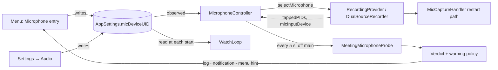

# Microphone in the menu and the meeting app's input

## Conversation Evidence

> issue #43 (body, translated): "The app records the microphone from Settings → Audio (default: 'System Default'). If Teams/Zoom uses another device (e.g. the headset, while the macOS default input is the built-in microphone), your own voice is recorded from the wrong microphone and far too quietly (measured: ~25 dB quieter, see #4). Setting it manually in Settings only helps as long as you remember to."
> issue #43 (wish, translated): "1. Automatically follow the meeting app's microphone … 2. In the menu bar menu, show the input device currently in use and switch it quickly via a submenu (fallback when 1 is not unambiguous). 3. Warn when the recorded microphone is not the meeting app's."
> issue #43 (feasibility, translated): "macOS reports per process the devices it exchanges audio with (`kAudioProcessPropertyDevices`, Core Audio process objects, macOS 14.2+). The app already reads this for the output (`ProcessOutputState` in AudioTapLib); for the input it is the same property with the input scope. Open: meeting apps may record through their own virtual device ('Microsoft Teams Audio') or a voice-processing aggregate; then the property does not show the physical microphone directly. First step: a small measurement probe during a real Teams and Zoom call that prints the input devices per process (device names only, no sound)."
> issue #4 (wish, translated): "At recording start, make visible which microphone actually records, and warn when it is not the device the meeting app uses (as far as it can be determined)."
> issue #4 (owner comment 2026-10-06, translated): "Open: (a) warning when the recorded microphone is not the meeting app's (depends on the measurement probe from #43) …"
> issue #44 (body, translated): "A change of the microphone in Settings during the recording only takes effect at the next recording."
> coordinator triage 2026-10-06: "Must-first slice for this spec: (1) the menu bar menu shows the microphone currently recorded (or that will be recorded) and a submenu to switch it; (2) a measurement probe: log, per process the app watches or taps, the INPUT devices it uses … — device names only, never device UIDs in unconditional lines …; (3) a warning when the recorded microphone is not the one the meeting app uses, where the probe can tell (this is part (a) moved here from issue #4)."
> coordinator triage 2026-10-06 (owner decision, answer given in the session): "the menu switch changes the app's own microphone setting (the same `AppSettings.micDeviceUID` as Settings → Audio → Microphone), not the macOS input device; it takes effect in a running recording (restart the mic capture on the new device through the existing device-change restart path), otherwise for the next recording."
> coordinator triage 2026-10-06: "Depends on spec `gh-44-…` …: pinning a headset in the app is broken today (restart loop, no buffers); switching via the menu uses exactly that path." · "'Automatically follow the meeting app's microphone' (issue point 1) needs evidence first … auto-follow itself is a follow-up spec, not planned here." · "Menu-bar dropdown interaction is manual-QA-only (CLAUDE.md GUI Testing): put the decision logic in pure value types and test there."

## Goal & Context

When a meeting app uses one microphone (say a headset) and the app records another (say the built-in microphone, because the app is on "System Default" and macOS's default input is the built-in one), your own voice ends up far too quiet in the recording, and today nothing tells you; the only remedy is to remember to change Settings before each meeting. [paraphrase] This spec makes the recorded microphone visible and switchable from the menu bar, applies a switch at once even in the middle of a recording, and warns during a recording when the app can tell that the meeting app uses a different microphone. [paraphrase] It also writes a measurement probe to the log, because whether macOS names the meeting app's physical microphone at all, or only a virtual or voice-processing device, decides whether the app can later follow the meeting app's microphone on its own; that automatic follow is the next spec, built on the probe's evidence. [paraphrase]

**What the app does today (checked on `wapp/main` at 65888b53; file references are in the tasks).** [inferred]
- Settings → Audio → Microphone stores one setting, `AppSettings.micDeviceUID` (empty means System Default), chosen from the audio capture devices AVFoundation lists; a device's identifier there is its Core Audio device UID.
- Watching and manual recordings copy that setting into their watch loop when they start, so a change while watching is on reaches no recording until watching is restarted, and a change during a recording never reaches it (issue #44's third cause).
- The microphone capture already knows how to restart in place: a device change claims one restart attempt (aimed at the chosen device while it is present, the system default otherwise), builds a fresh engine session under the restart arbiter's generation and deadline, retries with backoff, and writes the gap as silence. The chosen device is held by the capture handler and set only when it starts. The arbiter launches an attempt only while capturing normally; an event during an outstanding attempt or a backoff is ignored, and a retry re-reads the chosen device.
- Which device a recording actually captures is known only inside the capture library (the pinned device when the pin took, the system default otherwise) and reaches only a verbose debug line.
- The capture library reads each tapped process's output devices for diagnostics; nothing reads the input side. The recorder resolves the process ids it taps when a recording starts and keeps no copy.
- The menu shows no microphone.

**Dependency.** Spec gh-44 (issue #44) makes a pinned headset deliver audio at all: it absorbs the configuration change the pin itself causes and bounds configuration-change restarts. A switch made through this spec goes through exactly that pin and restart path, so this spec builds on gh-44's code and is not useful for headsets before it lands. [paraphrase]

<!-- Source: 0% user / 35% [paraphrase] / 65% [inferred] -->

## Architecture & Data Models



**Capture library (AudioTapLib): switch the microphone of a running capture and report the device in use.** [inferred]
- `MicInputDevice` (uid, name, both optional) becomes public, with a public `systemDefaultInput()` that names the macOS default input from Core Audio's default-input-device property, the same definition the capture engine uses when nothing is pinned.
- `MicCaptureHandler.activeInputDevice: MicInputDevice?` (public, main queue): the device the current engine session reports, captured where the session was brought up (so no new hardware read lands on the main queue during a restart) and published at the first start and at every adoption; nil before the first start and after a stop or give-up.
- `MicCaptureHandler.selectDevice(uid: String?)` (public, main queue). Equal to the current choice → nothing. Otherwise it stores the new choice and requests a restart with a new trigger, `deviceSelected`, through the same claim-and-launch path a device change takes (so, like a device change, it is charged neither to the stall watchdog's budget nor to gh-44's configuration-change budget). If no attempt can be launched because one is outstanding or backing off, the selection is marked pending. A retry launched while a selection is pending aims at exactly what the new choice resolves to, System Default (nil) included; today's retry falls back to the previous device when the current target is nil, which would keep retrying a failing old device instead of the chosen default. At the next adoption, if the adopted target differs from what the current choice resolves to, one more `deviceSelected` restart is claimed. In a sealed session (stopped, given up) nothing is restarted.
- `AudioCaptureSession` forwards both as `micInputDevice` and `selectMicrophone(deviceUID:)`; without a microphone capture they return nil and do nothing. It also reports `microphoneTrackActive`: true only while a microphone capture exists and has not given up (false when no microphone was requested, when its start failed and the session continued app-only, and after a give-up).
- New capture log lines at notice level, without device UID or name: a selection that restarts the capture, a selection deferred behind a running restart, and the adoption of a selection restart with its sample rate.

**App: one setting, applied live and at the next recording.** [inferred]
- The recorder roles (`AudioCapturing`, `RecordingProvider`) gain `micInputDevice`, `microphoneTrackActive` and `selectMicrophone(deviceUID:)`; `RecordingProvider` also gains `tappedPIDs: [pid_t]`, with defaults (nil, false, no-op, empty) for test doubles. `DualSourceRecorder` keeps the process ids it tapped for the recording's lifetime and forwards the other two to its capture session.
- `WatchLoop` reads the chosen microphone through a closure at each recording start (both start paths), the way it already reads verbose diagnostics.
- New `MicrophoneController` (`@Observable`, main actor, owned by `AppState` as `microphone`):
  - observes `micDeviceUID` and, while a recording is attached, passes a changed choice to the recorder (empty → nil);
  - is attached and detached by the same recording state transitions that start and stop channel-health monitoring, receiving a recorder provider and the meeting app's name;
  - while attached, ticks once a second and publishes `recordedDevice` from the recorder (a stored snapshot, no hardware read);
  - holds the device list (`devices`, the list Settings shows, via a shared `MicrophoneDevices` helper that Settings also uses) and the default input's name, refreshed at start-up, when a device connects or disconnects, when the macOS default input changes, and at each recording start.
- New pure `MicrophoneMenuState.resolve(noMic:selectedUID:devices:defaultInputName:recordedDevice:meetingAppHint:)` gives the entry's title, enabled flag, items (UID, or empty for System Default, plus label), the checked UID and the optional hint line. The menu renders it as a submenu whose picker shows the checkmarks, with the hint as a disabled line; choosing an item writes `micDeviceUID`.

**App: probe and mismatch warning.** [inferred]
- `MeetingMicrophoneProbe` (hardware side) maps the recording's tapped process ids to Core Audio process objects, skips ids without one, and reads per process whether it runs input (`kAudioProcessPropertyIsRunningInput`) and its input devices (`kAudioProcessPropertyDevices`, input scope); per device it reads UID, name and transport type. Every read, the name included, keeps its `OSStatus` on failure (no helper that drops the status); the property reads are injectable so a test can feed failures through the reader into the log lines. Reads run on one serial queue, never the main queue, with at most one read outstanding; each result carries the recording it was started for and is dropped when that recording is no longer attached.
- A recording is probed only while it taps a meeting app (non-empty tapped process ids) and its microphone track is actually running (`microphoneTrackActive`), not merely requested: a microphone that failed to start or gave up stops the probing. A running track whose device cannot be named is probed and yields `recordedMicrophoneUnknown`.
- `MeetingMicrophoneVerdict.evaluate(processes:recordedDeviceUID:)` (pure), over the processes that read as running input: `match` when any of their input devices has the recorded microphone's UID; `mismatch(appDevices)` when every one of their input devices is identifiable (UID and transport readable, transport a physical kind, so neither aggregate, auto-aggregate, virtual nor unknown) and none is the recorded microphone; otherwise `undetermined` with one of `noProcessCapturingInput`, `unidentifiableDevice`, `unreadableProperty`, `recordedMicrophoneUnknown`.
- `MeetingMicrophoneWarningPolicy` (pure; production limits: probe every 5 s, 2 consecutive mismatches before warning, 1 notification per recording, 20 change log entries per recording) decides per probe whether to notify, the current menu hint (present while the latest verdict is a mismatch), and which log lines to write.
- Log lines (app subsystem, category `MeetingMicrophone`, notice level, a mismatch verdict at warning level), all without device UID; device names only in the verbose-gated line:
  - `Meeting app microphone (first|change): exe=<name> pid=<pid> isRunningInput=<true|false|?(status)> inputDevices=[<objectID>/<transport>/<recorded|other|?>, …]` for each tapped process that does not read `isRunningInput=false` or that lists any input device;
  - `Meeting app microphone verdict (first|change): match | mismatch | undetermined(<reason>) processesWithAudioObject=<n>/<tapped> capturingInput=<n>`;
  - `Meeting app microphone at stop: lastVerdict=<…> probes=<n> skippedProbes=<n> warned=<true|false>`;
  - with Verbose Audio Logging on, `[debug] Meeting app microphone devices: <objectID> name=<name> transport=<transport>; …` next to each first/change entry.
- Notification (time-sensitive): title `Microphone differs from <App>`, body `Recording from <recorded name>, but <App> uses <device names>. Choose the microphone in the menu bar under Microphone.` Menu hint: `<App> uses <device names>`.

## Edge Cases & Constraints

- "No Microphone (app audio only)" on: the entry is one disabled `Microphone: Off (app audio only)` line with no submenu; nothing is probed; a changed choice restarts nothing because there is no microphone track. [inferred]
- Microphone-only recording: no tapped process, so no probe and no warning; a switch applies live. [inferred]
- A microphone track that failed to start (the recording continues app-only) or was given up: nothing restarts, nothing is probed, the menu names the device the next recording would use, and the choice applies from the next recording. [inferred]
- The chosen device disconnects during a recording: the existing fallback records the system default with its warning; the title names the device actually recording, and the submenu shows the stored choice as `Selected microphone (not connected)`, checked and disabled. [inferred]
- Several choices in quick succession: one attempt runs at a time and the pending mark makes the last choice win. [inferred]
- System Default (or a device that is not connected) chosen while the previous device's restart is backing off after a failure: the next retry aims at the system default, not at the failing previous device. [inferred]
- A choice landing between the recording's phase change and the recorder's start: the start reads the new value and no restart is needed. [inferred]
- Switching to a Bluetooth headset mid-recording can move it into its call profile, which also restarts the app-audio capture on its own path; the residual race documented for issue #693 stays as it is. [inferred]
- During a selection restart the reported device is the previous one until adoption, so one probe can compare against the old device; the two-probe rule absorbs that. [inferred]
- The meeting app opens a different microphone mid-call: the next probe sees it; the notification is not repeated (one per recording) but the menu hint follows the latest probe. [inferred]
- The meeting app records through a voice-processing aggregate, its own virtual device or the default-device aggregate: the probe logs aggregate, virtual or unreadable and the verdict is undetermined, so no warning; the owner's real-call check shows how often that happens. [paraphrase]
- Helper processes the meeting app starts after the recording began are not probed (the process ids are the ones the recording tapped). [inferred]
- A hardware read that never returns: later probes are skipped and counted, and the main thread never waits on one (the issue #588 lesson). [inferred]
- A probe result arriving after its recording stopped, or for an earlier recording, is dropped. [inferred]
- Notifications denied or hidden: the warning is not seen, the menu hint still shows it. [inferred]
- Privacy: unconditional log lines carry executable names, process ids, Core Audio object ids, transport types, booleans and status codes only; device names appear only in the verbose-gated `[debug]` line; no log line carries a device UID; the menu and the notification show device names, which is UI. [inferred]
- Several touched source files sit just under the 600-line limit that the strict lint enforces; new logic goes into new files or extension files (the tasks name them). [inferred]
- App Store variant: nothing here needs a `#if APPSTORE` branch, but both variants must compile. [inferred]
- `CLAUDE.md` and `AGENTS.md` belong to the original project and are not edited (fork rule); the rationale lives in doc comments and the architecture document's file table. [inferred]

### Verification

- Capture library, fake engine sessions only (CI has no audio hardware): a selection while capturing launches exactly one attempt aimed at the new UID and publishes the new active device on adoption; the same UID launches nothing; a selection during an outstanding attempt is applied by one more attempt after that adoption, and the last of several wins; a selection during a backoff is picked up by the retry, including System Default and an unconnected UID while the previous device keeps failing (the next attempt receives nil); a selection after stop or give-up launches nothing; a UID that is not present targets the default; the stall watchdog's and gh-44's configuration-change counters do not move. [inferred]
- App: the watch loop reads the current choice at every start; the controller passes a changed choice only to an attached recording and publishes the recorded device and device list; the menu state covers every arm of R1, R2 and the hint; one view-wiring test drives the menu's picker by its accessibility identifier and checks the selection reaches the setting writer; the Settings list comes from the same helper; the verdict and the warning policy cover every reason and limit; the probe's log-line builders are checked for wording, for no names in unconditional lines and for no UID anywhere; a controller test with an injected probe reader and a recording notifier turns two mismatching probes into exactly one notification. [inferred]
- Lint with the pinned tools and a release build of both variants. [inferred]
- Real devices, real calls and the menu's look are the owner's checks after merge, not tasks. [inferred]

## Acceptance Criteria

- **R1:** The menu bar menu has a Microphone entry whose title names a microphone: while a recording captures the microphone, the device that capture reports it is recording from, updated within about a second of a change; otherwise the device the next recording would use, that is the chosen device's name or `System Default (<name of the macOS default input>)`. Errors: when the chosen device is not connected, the title names the system default and says the chosen microphone is not connected; when no input device exists, the title says no microphone is available; when "No Microphone (app audio only)" is on, the entry is one disabled `Microphone: Off (app audio only)` line without a submenu. [paraphrase]
- **R2:** The entry's submenu lists `System Default (<name>)` followed by every microphone Settings → Audio → Microphone lists, in the same order, with the current choice checked; choosing one stores it in the same setting Settings → Audio → Microphone uses, so both show the same choice afterwards, and the macOS default input device is never changed. Errors: a stored choice whose device is not connected shows as a checked, disabled `Selected microphone (not connected)` item; devices connected or disconnected, and a changed macOS default input, show up in the list without restarting the app. [paraphrase]
- **R3:** When the chosen microphone changes, from the menu or from Settings, while a recording captures the microphone, only the microphone capture restarts, on the newly chosen device (System Default meaning the macOS default input), through the same restart path a device change takes, in the same recording and the same microphone file; the restart gap becomes silence and the app-audio track is not interrupted. Choosing the device already chosen restarts nothing. Errors: a choice made while a restart is running is applied right after that restart, a retry after a failed attempt already aims at the new choice (System Default included, never back at the failing previous device), and the last choice wins; a chosen device that is not connected records from the system default with the existing warning; a recording whose microphone track was never opened, failed to start or was given up is not restarted, and the choice applies from the next recording. [paraphrase]
- **R4:** A choice made while no recording runs is used by the next recording, whether meeting watching is on or off, without restarting watching. Errors: none beyond R3. [paraphrase]
- **R5:** While a recording taps a meeting app and captures the microphone, the app reads every 5 seconds, for every tapped process, whether it is capturing audio input and which input devices it uses, and writes to the app log at notice level or higher: at the first probe and after each change, one line per input-active process (executable name, process id, whether input runs, and per input device its Core Audio object id, transport type and whether it is the recorded microphone) and one verdict line (match, mismatch, or undetermined with its reason); at stop, one summary line (last verdict, probes run, probes skipped, whether a warning was posted); with Verbose Audio Logging on, a `[debug]` line next to each first or change entry also names the devices. Errors: a property that cannot be read appears as `?(<OSStatus>)`, never as a plausible value; no unconditional line contains a device name and no line contains a device UID; reads run off the main thread with at most one outstanding, and a probe due while one is outstanding is skipped and counted; change entries stop after 20 per recording with one line saying so; a result that arrives after its recording stopped is discarded; a failed name read is shown as `?(<OSStatus>)` in the `[debug]` line. [paraphrase]
- **R6:** When two consecutive probes find that the tapped processes capturing input use only devices the app can identify (UID and transport type readable, transport a physical kind, so neither aggregate, virtual nor unknown) and none of them is the recorded microphone, the app posts one time-sensitive notification for that recording naming the meeting app, the device or devices it uses and the recorded microphone, and pointing to the Microphone entry in the menu bar; while the latest probe shows that mismatch, the menu's Microphone entry shows `<App> uses <device>`. Errors: when the probe cannot tell (no tapped process capturing input, an unidentifiable device, an unreadable property, recorded microphone unknown), nothing is shown or posted and the verdict line says why; at most one such notification per recording; the hint disappears at the first probe that shows a match or cannot tell, and when the recording stops; recordings without a tapped app, or whose microphone track is not running (never requested, failed to start, given up), are never probed, and probing stops when the track gives up. [paraphrase]
- **R7:** The microphone restart machinery treats a selection restart like a device-change restart: the arbiter's single attempt, deadline, retries and give-up apply, and it is charged neither to the stall watchdog's budget nor to gh-44's configuration-change budget; the Settings microphone list is unchanged; both build variants compile and the existing suites pass. Errors: none beyond the suites.

## Early proof point

Task gh-43-microphone-in-the-menu-and-the-meeting.1 validates the core approach (a running microphone capture can be moved to another device by reusing the existing claim-and-launch restart path, without touching the restart arbiter's transition table, and reports the device it ends up on). If it fails, re-evaluate how a selection enters the restart path (an arbiter event of its own) before continuing with gh-43-microphone-in-the-menu-and-the-meeting.2+.

## Boundaries

- Automatically following the meeting app's microphone (issue #43 point 1) is a follow-up spec that waits for the probe's evidence from real Teams and Zoom calls. [paraphrase]
- Resolving an aggregate or virtual input device to the physical microphone behind it is out (follow-up, only if the probe shows meeting apps use such devices). [inferred]
- A "Switch to <device>" action on the warning notification is out (follow-up). [inferred]
- Naming the microphone in the "Meeting Detected" start notification is out (follow-up). [inferred]
- Changing the macOS default input device is out (D1). [paraphrase]
- Exposing the recorded device and the probe verdict on the automation API (`/state`) is out (follow-up). [inferred]
- Level balancing between the tracks (issue #4 part c) belongs to spec gh-4; making a pinned headset deliver audio belongs to spec gh-44. [paraphrase]
- Applying a changed "No Microphone" setting during a recording is out. [inferred]
- Probing helper processes started after the recording began is out. [inferred]

## Decision Context

- **D1 · The menu switch writes the app's own microphone setting (`AppSettings.micDeviceUID`, the same as Settings → Audio → Microphone), never the macOS default input; it applies to a running recording by restarting the microphone capture through the existing device-change restart path, otherwise to the next recording.** why: the owner's answer quoted in the coordinator triage of 2026-10-06 · status: active [owner-stated 2026-10-06]
- **D2 · The probe comes first; automatically following the meeting app's microphone waits for the probe's evidence and is a follow-up spec.** why: issue #43 "Erster Schritt: kleine Messsonde während eines echten Teams- und Zoom-Calls" and the coordinator triage of 2026-10-06 · status: active [owner-stated 2026-10-06]
- **D3 · Warn only where the probe can determine the meeting app's microphone.** why: issue #4 "warnen, wenn es nicht das Gerät ist, das die Meeting-App benutzt (soweit ermittelbar)" · status: active [owner-stated 2026-10-06]
- **D4 · The probe records device identities only, never audio.** why: issue #43 "nur Gerätenamen, kein Ton" · status: active [owner-stated 2026-10-06]
- **A1 · Device names appear only in the verbose-gated `[debug]` probe line; the unconditional lines carry object id, transport type and whether a device is the recorded microphone, and no line carries a device UID.** flip at: the probe's log-line builders · test: the probe log-line tests · alternatives: names in the unconditional lines (the coordinator's wording allows it), rejected because those lines reach the exported "redacted" diagnostics file and Bluetooth device names usually carry a person's name, the same reason the existing pin-outcome line and spec gh-44 keep names and UIDs out · status: active [agent-inferred 2026-10-06]
- **A2 · Probe every 5 s; warn after 2 consecutive mismatching probes; one time-sensitive notification per recording; at most 20 change log entries per recording.** flip at: `MeetingMicrophoneWarningPolicy.Limits.production` · test: the warning-policy tests · status: active [agent-assumed 2026-10-06]
- **A3 · The probe can tell only when every input device of the input-capturing tapped processes has a readable UID and a readable transport type of a physical kind (not aggregate, auto-aggregate, virtual or unknown).** flip at: `MeetingMicrophoneVerdict.evaluate` · test: the verdict tests, and the owner's real-call check shows whether Teams and Zoom ever pass it · status: active [agent-inferred 2026-10-06]
- **A4 · The probe covers the process ids the recording tapped at its start, not processes started later.** flip at: `DualSourceRecorder.tappedPIDs` · test: the controller test reads the recorder's `tappedPIDs` · status: active [agent-assumed 2026-10-06]
- **A5 · A change made in Settings → Audio → Microphone during a recording applies live too, through the same observer as the menu.** flip at: the settings observer in `MicrophoneController` · test: the controller test changing the setting during an attached recording · why: D1 makes the menu and Settings one setting, issue #44 names the missing live pickup as a cause, and spec gh-44 leaves it to this spec · status: active [agent-inferred 2026-10-06]
- **A6 · A choice made while a restart attempt runs is applied right after that attempt's adoption, and the last choice wins.** flip at: the device-selection extension of `MicCaptureHandler` · test: the capture-library selection tests · status: active [agent-assumed 2026-10-06]
- **A7 · The menu lists exactly the Settings device list (shared code) after `System Default (<name>)`; with "No Microphone" on, the entry is one disabled `Microphone: Off` line.** flip at: `MicrophoneDevices` and `MicrophoneMenuState.resolve` · test: the menu-state tests · status: active [agent-assumed 2026-10-06]
- **A8 · During a recording the menu names the device the capture reports it is bound to (refreshed every second), not the configured one.** flip at: `MicrophoneController`'s tick · test: the controller and menu-state tests · why: a refused or not-adopted pin records on the system default, and naming the configured device there would hide exactly that · status: active [agent-inferred 2026-10-06]
- **A9 · "System Default" is named from Core Audio's default-input-device property, not from AVFoundation's default capture device.** flip at: `MicInputDevice.systemDefaultInput()` · test: the menu-state tests take the name as input; the owner's look-and-feel check compares it with System Settings → Sound → Input · why: it is the device the capture engine follows when nothing is pinned, and AVFoundation's device order is documented as unrelated to the system default · status: active [agent-inferred 2026-10-06]
- **A10 · Menu titles read `Microphone: <device>`; a chosen device that is not connected reads `Microphone: <device> — selected microphone not connected`, and no input device at all reads `Microphone: None available`.** alternatives: B — `Microphone: <device> (selected microphone not connected)`; C — a bare `No microphone available` line · flip at: `MicrophoneMenuState.swift:MicrophoneMenuState.resolve` · test: `MicrophoneMenuStateTests.testAChosenDeviceThatIsNotConnectedIsNamedMissingAndStaysChecked`, `testNoInputDeviceSaysNoMicrophoneIsAvailable` · status: active [agent-assumed 2026-10-09]
- **A11 · The "selected microphone not connected" suffix also shows during a recording, beside the name of the device actually recording.** alternatives: B — suffix only while idle · flip at: `MicrophoneMenuState.swift:MicrophoneMenuState.resolve` (the recording arm's `chosenMissing`) · test: `MicrophoneMenuStateTests.testAChosenDeviceThatIsNotConnectedIsNamedMissingAndStaysChecked` · status: active [agent-assumed 2026-10-09]
- **A12 · The Microphone entry carries the SF Symbol `mic` and the off line `mic.slash`, as a Label like the neighbouring menu items.** alternatives: B — plain text without an icon · flip at: `MenuBarView.swift:microphoneSection` · test: `MenuBarMicrophoneTests.testNoMicShowsTheOffLineAndNoPicker` · status: active [agent-assumed 2026-10-09]
- **A13 · The menu hint `<App> uses <device>` shows from the first mismatching probe; only the notification waits for the second consecutive mismatch.** alternatives: B — show the hint only together with the notification, after the second mismatch · flip at: `MeetingMicrophoneWarningPolicy.swift:record` (`outcome.hintDevices`) · test: `MeetingMicrophoneWarningPolicyTests.testTheHintShowsOnlyWhileTheLatestVerdictIsAMismatch`, `MicrophoneControllerMeetingProbeTests.testTwoMismatchingProbesPostOneTimeSensitiveNotificationAndShowTheHint` · status: active [agent-assumed 2026-10-09]
- **A14 · In the notification and the hint several device names are joined with `, `; an unreadable device name reads `an unnamed device`, a recorded microphone without a name `an unnamed microphone`, and a missing app name `the meeting app`.** alternatives: B — join as `A and B`; C — leave unnamed devices out · flip at: `MeetingMicrophoneWarningPolicy.swift:deviceNames` and `notification(appName:recordedName:devices:)` · test: `MeetingMicrophoneWarningPolicyTests.testTheNotificationAndHintWording` · status: active [agent-assumed 2026-10-09]

Maintainability (plan review): duplication - task .1 copies the fake engine-session helpers from the stall-watchdog tests and task .5 copies the PID-translation and device-list reads from the capture library (accepted: test doubles stay private per suite, and the app keeps its own status-keeping reads); structure - none identified

FIT: GO · 2026-10-09 · base 47c550ad · engine flow-next 8.1.1 · since the plan review gh-44 (the dependency), gh-73, gh-54, gh-94, gh-4, gh-1, gh-12, gh-7 and two upstream merges landed; the restart path still claims and launches as described (handleDeviceChange now returns Bool, attempts build only under the gh-73 seal check, a selection restart through handleDeviceChange is charged to neither budget), the menu puts gh-94 controls under the status line and the Microphone entry fits after the watch controls, no spec claims this scope; AppState.swift is at 599 and DualSourceRecorder.swift at 591 lines, so the planned extension files are mandatory

## Resolved via Research
<!-- provenance: plan (inline research by the planning session; scouts were not dispatched) on 2026-10-06 -->

### docs-scout
- **Core Audio `kAudioProcessPropertyDevices`** — an array of device ids the process currently uses for input or for output; the property scope selects which list, so the input list is the same selector with `kAudioObjectPropertyScopeInput`. `kAudioProcessPropertyIsRunningInput` is 1 only while the process runs IO with at least one active input stream. Source: macOS SDK `CoreAudio.framework/Headers/AudioHardware.h`, Process Properties.
- **Core Audio transport types** — `kAudioDeviceTransportTypeAggregate` ('grup') and `kAudioDeviceTransportTypeVirtual` ('virt') are in `AudioHardwareBase.h`, but `kAudioDeviceTransportTypeAutoAggregate` ('fgrp') is declared only in `AudioHardwareDeprecated.h`; naming it would raise a deprecation warning, so the verdict classifies by an allow-list of physical transports instead of naming the excluded ones. Source: macOS SDK `CoreAudio.framework/Headers/AudioHardwareBase.h`, `AudioHardwareDeprecated.h`.
- **SwiftUI `MenuBarExtra` (menu style)** — a `Picker` with `.pickerStyle(.inline)` inside a `Menu` renders native menu items with a checkmark on the selected one. Source: https://github.com/woosublee/quill/issues/394 and https://bdewey.com/til/2023/08/13/creating-menu-items-with-checkmarks-in-swiftui/

### practice-scout
- **Gotcha:** the order of AVFoundation's audio device discovery has nothing to do with the macOS default input; read the default from Core Audio's default-input-device property. Source: https://github.com/dburkhardt/muesli/issues/20

### docs-gap-scout
- **Docs that must change:** `docs/architecture-macos.md` file tables — a row for every new source file, and the `MenuBarView.swift` and `Settings/AudioSettingsView.swift` rows mention the microphone entry and the shared device list. Source: `docs/architecture-macos.md` "App Entry & UI" and capture-library tables.
- **Docs not changed:** `CLAUDE.md` / `AGENTS.md` belong to the original project (fork rule); `docs/automation-api.md` is unaffected because `/state` is out of scope. Source: `.claude/rules/wapp-fork.md`.

## Quick commands

```bash
cd tools/audiotap && swift test --parallel --filter MicCaptureHandler > /private/tmp/gh43-audiotap.log 2>&1; echo "exit $?"
cd app/MeetingTranscriber && CFFIXED_USER_HOME=/private/tmp/gh43-home swift test --parallel --filter 'Microphone|MeetingMicrophone|WatchLoopTests|MenuBar' > /private/tmp/gh43-app.log 2>&1; echo "exit $?"
./scripts/lint.sh
./scripts/pre-push.sh --with-appstore
```

## Requirement coverage

| Req | Description | Task(s) | Gap justification |
| --- | --- | --- | --- |
| R1 | The menu bar menu has a Microphone entry whose title names a microphone: while a recording captures the microphone, the device that capture reports it is recording from, updated within about a second of a change; otherwise the device the next recording would use, that is the chosen device's name or `System Default (<name of the macOS default input>)`. Errors: when the chosen device is not connected, the title names the system default and says the chosen microphone is not connected; when no input device exists, the title says no microphone is available; when "No Microphone (app audio only)" is on, the entry is one disabled `Microphone: Off (app audio only)` line without a submenu. | gh-43-microphone-in-the-menu-and-the-meeting.4 | — |
| R2 | The entry's submenu lists `System Default (<name>)` followed by every microphone Settings → Audio → Microphone lists, in the same order, with the current choice checked; choosing one stores it in the same setting Settings → Audio → Microphone uses, so both show the same choice afterwards, and the macOS default input device is never changed. Errors: a stored choice whose device is not connected shows as a checked, disabled `Selected microphone (not connected)` item; devices connected or disconnected, and a changed macOS default input, show up in the list without restarting the app. | gh-43-microphone-in-the-menu-and-the-meeting.4 | — |
| R3 | When the chosen microphone changes, from the menu or from Settings, while a recording captures the microphone, only the microphone capture restarts, on the newly chosen device (System Default meaning the macOS default input), through the same restart path a device change takes, in the same recording and the same microphone file; the restart gap becomes silence and the app-audio track is not interrupted. Choosing the device already chosen restarts nothing. Errors: a choice made while a restart is running is applied right after that restart, a retry after a failed attempt already aims at the new choice (System Default included, never back at the failing previous device), and the last choice wins; a chosen device that is not connected records from the system default with the existing warning; a recording whose microphone track was never opened, failed to start or was given up is not restarted, and the choice applies from the next recording. | gh-43-microphone-in-the-menu-and-the-meeting.1, gh-43-microphone-in-the-menu-and-the-meeting.3 | — |
| R4 | A choice made while no recording runs is used by the next recording, whether meeting watching is on or off, without restarting watching. Errors: none beyond R3. | gh-43-microphone-in-the-menu-and-the-meeting.2 | — |
| R5 | While a recording taps a meeting app and captures the microphone, the app reads every 5 seconds, for every tapped process, whether it is capturing audio input and which input devices it uses, and writes to the app log at notice level or higher: at the first probe and after each change, one line per input-active process (executable name, process id, whether input runs, and per input device its Core Audio object id, transport type and whether it is the recorded microphone) and one verdict line (match, mismatch, or undetermined with its reason); at stop, one summary line (last verdict, probes run, probes skipped, whether a warning was posted); with Verbose Audio Logging on, a `[debug]` line next to each first or change entry also names the devices. Errors: a property that cannot be read appears as `?(<OSStatus>)`, never as a plausible value; no unconditional line contains a device name and no line contains a device UID; reads run off the main thread with at most one outstanding, and a probe due while one is outstanding is skipped and counted; change entries stop after 20 per recording with one line saying so; a result that arrives after its recording stopped is discarded; a failed name read is shown as `?(<OSStatus>)` in the `[debug]` line. | gh-43-microphone-in-the-menu-and-the-meeting.5 | — |
| R6 | When two consecutive probes find that the tapped processes capturing input use only devices the app can identify (UID and transport type readable, transport a physical kind, so neither aggregate, virtual nor unknown) and none of them is the recorded microphone, the app posts one time-sensitive notification for that recording naming the meeting app, the device or devices it uses and the recorded microphone, and pointing to the Microphone entry in the menu bar; while the latest probe shows that mismatch, the menu's Microphone entry shows `<App> uses <device>`. Errors: when the probe cannot tell (no tapped process capturing input, an unidentifiable device, an unreadable property, recorded microphone unknown), nothing is shown or posted and the verdict line says why; at most one such notification per recording; the hint disappears at the first probe that shows a match or cannot tell, and when the recording stops; recordings without a tapped app, or whose microphone track is not running (never requested, failed to start, given up), are never probed, and probing stops when the track gives up. | gh-43-microphone-in-the-menu-and-the-meeting.5 | — |
| R7 | The microphone restart machinery treats a selection restart like a device-change restart: the arbiter's single attempt, deadline, retries and give-up apply, and it is charged neither to the stall watchdog's budget nor to gh-44's configuration-change budget; the Settings microphone list is unchanged; both build variants compile and the existing suites pass. Errors: none beyond the suites. | gh-43-microphone-in-the-menu-and-the-meeting.1 | — |

