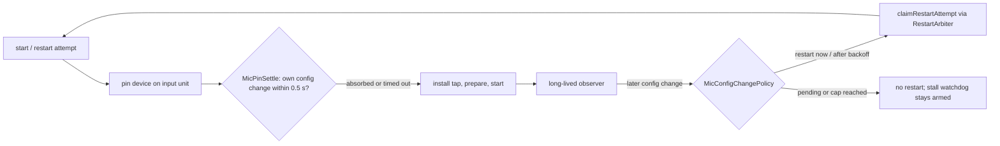

# Stop the microphone restart loop on a pinned headset

## Conversation Evidence

> issue #44 (body, translated): "Settings → Audio → Microphone pinned to a USB headset (wireless headset via USB dongle); 'System Default' was the built-in MacBook microphone. … Result: microphone track 3.4 min long, 100 % exact zeros; app track 9.8 min normal. Your own voice is missing from the whole meeting."
> issue #44 (comment, runs 1 and 2, translated): "If the headset is pinned in Settings → Audio, the microphone engine delivers not a single buffer. Run 1: `Mic device set` (OK) → `Mic input device … hwRate=48000 hwChannels=1` → twice `engine configuration changed (format/route change)` within 0.5 s → each time `engine restarted … (48000 Hz)` → `mic lastBuffer=never lastEnergy=never`."
> issue #44 (comment, part 1 plan, translated): "No automatic switch to the default microphone while the chosen device is present (otherwise e.g. the headset's hardware mute would be bypassed)."
> issue #44 (comments, runs 3 and 4, translated): "App on 'System Default', headset as macOS default input → buffers arrive … no `configuration changed`, no restart, Teams taking over the headset did not disturb. Result: the default path works in a call too; the fault lies solely in the path 'choose the device in the app'."
> issue #44 (comment, test 2026-10-06 21:51, translated): "Starts of the microphone engine in 35 s: **233** · 'iounit configuration changed' from AVAudioEngine: **232**, each ~50–100 ms after each start · stall watchdog from part 1: never fired. Mechanism: every start on the Jabra immediately leads to a configuration change; the app restarts on it (existing path `AVAudioEngineConfigurationChange` → `handleDeviceChange`); the new start triggers the next change. Not one buffer ever arrives. … Fix: throttle restarts on configuration changes (backoff, cap per minute), so that a loop without buffers can never arise again."
> coordinator triage 2026-10-06: "Scope (must): (1) the restart loop can never recur: recognise a configuration change our own start caused (fires right after our start, same device and format) and do not restart for it, plus a backoff and a cap on configuration-change restarts per minute, and the stall watchdog must still be able to act; (2) find from the code why the pinned path never delivers a buffer, and if the code shows a fix …, plan it. If the root cause cannot be settled from code alone, plan the safe part (1) plus diagnostic log lines (no device UIDs in unconditional lines) and list the owner's headset test as a human check." · "Owner constraint already in the issue: never switch automatically to a different microphone than the one chosen while that one is present." · "Part 1 is merged (PR #57 …): a stall watchdog. Read its code; do not redo it." · "Issue #55 … is a separate watch item; do not plan it unless your fix makes it worse."

## Goal & Context

With a headset pinned as the microphone in Settings → Audio → Microphone, the microphone track of a recording is empty: the capture engine is started, stopped and rebuilt hundreds of times per minute and never delivers a single buffer, while the same headset works when the app is on "System Default" and the headset is the macOS default input. [paraphrase] The goal is that a pinned microphone records, and that whatever the device does, the microphone capture can never again spin in a restart loop that starves the stall watchdog merged in PR #57. [paraphrase]

**Why the pinned path delivers nothing, from the code.** `MicEngineSession.hardwareFormat(deviceUID:)` first reads `engine.inputNode`, which binds the engine's input unit to AVAudioEngine's own default-device aggregate, and then moves that unit to the pinned device with `kAudioOutputUnitProperty_CurrentDevice`. `MicCaptureHandler.startEngine` installs the tap and starts the engine milliseconds later. [inferred] Moving the unit's device makes AVAudioEngine post `AVAudioEngineConfigurationChange` about 100 ms later from a private queue; this was measured in another open-source macOS dictation app, whose fix waits for that notification before handing the engine over, and it matches the 21:51 log (one change 50–100 ms after each start). [inferred] Apple's header for the notification says that when the engine's I/O unit observes a change to the input or output hardware's channel count or sample rate, the engine stops itself and then posts it; moving the unit from the aggregate to the headset is such a change whenever the two differ in either direction, so the pin's own notification stops an engine that was started before it arrived, before the first 4096-frame buffer (about 85 ms at 48 kHz) could be delivered. [inferred] The handler's long-lived observer, installed after the first start and after every adoption, treats that notification as a route change and builds a fresh engine with a fresh pin (`launchRestartAttempt` → `runRestartAttempt`), whose pin posts the next notification: the 233-start loop. [inferred] When a notification instead lands before the observer is registered (run 1: two restarts, then silence), the engine has stopped itself and nothing restarts it. [inferred] The default path never pins, so it never posts this notification (runs 3 and 4). [paraphrase]

**Why the stall watchdog never fired.** Every adoption opens its 15-second grace and it does not judge while an attempt is outstanding (`MicStallWatchdogPolicy.tick`), so a restart every ~150 ms keeps it silent forever. [inferred]

**What is not settled from code.** In the first incident the pinned headset did deliver buffers for about 90 seconds, so the pin does not stop the engine under every condition; by the header's rule that depends on whether the headset's input and output formats differ from the aggregate's at that moment, which the code cannot know. [inferred] The fix does not depend on it: spending the pin's own notification before the engine starts is correct whether or not AVAudioEngine would have stopped, and the restart bounds hold whatever the device does. [inferred] Whether the pinned Jabra then delivers is confirmed only by the owner's headset check (see Verification). [inferred]

<!-- Source: 0% user / 35% [paraphrase] / 65% [inferred] -->

## Architecture & Data Models

All changes live in AudioTapLib (`tools/audiotap`). No app-target, settings or UI change. [inferred]



- **Absorb the pin's own configuration change (new type `MicPinSettle`).** A small helper that registers a one-shot observer for `.AVAudioEngineConfigurationChange` with `object:` the session's engine and `queue: nil` (the block only signals a semaphore, on whatever queue AVFAudio posts from), then runs the pin closure, and, when the pin reports that it moved the unit, waits up to `MicPinSettle.timeoutSeconds` (0.5 s) for that notification before returning; the observer is removed on every path. Its result is an `Outcome` value: `notNeeded`, `settled(afterSeconds:)`, `timedOut(afterSeconds:)`. The notification centre, the timeout and the clock are parameters so it is testable without audio hardware. [inferred]
- **Wiring in `MicEngineSession.hardwareFormat(deviceUID:)`.** The pin (`pin(deviceUID:on:)`) runs inside `MicPinSettle`; it reports "moved" only when `AudioUnitSetProperty` returned `noErr` and the unit's current device read *before* the set differed from the requested one (`currentDeviceID(of:)` already exists). The format is read after the settle, exactly as today (`inputNode.outputFormat(forBus: 0)`). Unpinned and unresolved-UID starts never wait. The settle runs wherever `hardwareFormat` runs today: on the main queue at a recording's first start (blocking it for at most 0.5 s, typically ~100 ms, only when a device is pinned) and on the restart queue inside an attempt (well within `RestartArbiter.attemptTimeout`, 5 s). [inferred]
- **Govern configuration-change restarts (new pure type `MicConfigChangePolicy`).** Value type in the style of `MicStallWatchdogPolicy` (`Limits` struct with a `.production` value, a `Decision` enum, monotonic seconds passed in). Per notification it decides one of: `restart(afterSeconds:)`, `ignore(.restartPending)`, `suppress`. Production limits: a sliding window of 60 s, at most 3 configuration-change restarts launched in it, backoff by how many were already launched in the window: 0 s, 1 s, 2 s. Only restarts the arbiter actually launched are recorded (`restartLaunched(at:)`), mirroring the watchdog's "only what the arbiter launched counts". It also records when the current engine started (`engineStarted(at:)`, called at the first start and at every adoption) for the log's "seconds since the engine started", and answers whether a non-launching decision should be logged (at most once per kind per window). [inferred]
- **Handler wiring (a new `MicCaptureHandler` extension file, like `+StallWatchdog`).** `installConfigChangeObserver()` and `handleEngineConfigChange()` move into it, because `MicCaptureHandler.swift` sits just under the 600-line lint cap; `handleEngineConfigChange()` becomes internal so tests can drive it like `pollStallWatchdog()`. On a notification it asks the policy (passing the stall clock's `now` and whether a delayed restart is pending) and either does nothing, or calls the existing `handleDeviceChange(.configurationChanged)` now, or schedules it after the backoff as one `DispatchWorkItem` on the main queue. When the delayed item fires it goes through `claimRestartAttempt` like every other trigger; the launch is recorded in the policy only when the arbiter granted it. The pending item is cancelled by `stop()`, by a give-up, and by any adoption (a newer session supersedes it). New stored state on the handler stays minimal: the policy value and the pending work item (both main-queue confined, like `session`), plus a `configChangeLimits:` parameter on the internal test-seam `init` defaulting to `.production`. [inferred]
- **Unchanged.** `RestartArbiter`, `CaptureRestartRetryPolicy`, `MicStallWatchdogPolicy` and its limits, the default-input-change trigger, `claimRestartAttempt`'s device choice (pinned device while present, default otherwise), and where the outgoing session is torn down. [inferred]

## Edge Cases & Constraints

- The notification for the pin arrives after the 0.5 s settle (a slow device): the engine has started, the long-lived observer catches it, and the policy restarts with backoff; the rebuilt engine settles again, so at most the cap's 3 restarts per minute follow. [inferred]
- The notification arrives before the long-lived observer is registered and the engine stopped itself: no buffers, so the stall watchdog (PR #57) restarts it after its grace and stall time; its restart's pin is absorbed by the settle like any other. [inferred]
- A genuine device or format change (Bluetooth profile switch, a sample-rate change in Audio MIDI Setup) still restarts at once on the first notification in a window, as today; a fourth notification within 60 s is suppressed, and the stall watchdog is the backstop for that case. [inferred]
- A default-input-device change is a separate trigger and is neither delayed nor counted by the new policy. [inferred]
- A stall restart or a default-input restart claimed while a delayed configuration-change restart is pending: the arbiter grants one attempt; the delayed item finds the arbiter busy (nothing launched, nothing counted) or is cancelled by the adoption. [inferred]
- Stop, give-up, or handler deallocation while a delayed restart is pending: nothing is launched afterwards (the arbiter refuses a sealed session in any case). [inferred]
- The pinned device is gone when a delayed restart fires: the existing rule takes the system default with its existing warning; while it is present it is always the target (owner constraint, D1). [paraphrase]
- Main-thread cost: at a recording's first start with a pinned device, the main queue is blocked for the settle (≤ 0.5 s). Engine teardown is unchanged and still on the main queue; fewer restarts mean fewer teardowns, so the risk tracked in issue #55 is not made worse. [inferred]
- Log privacy: every new line is unconditional, so it carries durations, counts and decisions only, never a device UID or name (CLAUDE.md Diagnostics; `MicDevicePinOutcome.logLine` rationale). [inferred]

### Verification

- `MicPinSettleTests` (new) with a private `NotificationCenter`: a notification posted from another queue after ~50 ms yields `settled`; none yields `timedOut` after the (test-short) timeout; a notification for another object is ignored; a notification posted synchronously inside the pin closure still counts; a pin that reports "not moved" returns `notNeeded` without waiting; the observer is removed afterwards (a later post changes nothing). [inferred]
- `MicConfigChangePolicyTests` (new): first restart immediate, second and third after 1 s and 2 s, fourth within the window suppressed, window sliding frees budget, a pending restart coalesces, declined launches are not charged, once-per-window logging of non-launching decisions. [inferred]
- `MicCaptureHandlerConfigChangeTests` (new, fake sessions in the `MicCaptureHandlerStallWatchdogTests` style): the 21:51 pattern (a configuration change after every adoption) builds at most 1 + 3 sessions, then the stall watchdog launches its restart once grace and stall time pass; the first change restarts immediately exactly as today; a delayed restart is cancelled by stop and superseded by an adoption; a pinned, present device is the target of every configuration-change restart; posting the real notification on the session's `notificationObject` reaches the policy. [inferred]
- The existing suites stay green unchanged, in particular `MicCaptureHandlerStallWatchdogTests`, `MicCaptureHandlerWedgeTests`, `MicEngineSessionSeamTests`, `RestartArbiterTests`, `MicStallWatchdogPolicyTests`. Run with `cd tools/audiotap && swift test --parallel > <log> 2>&1` and read the log; `./scripts/lint.sh` with the pinned tools from `scripts/tool-versions.sh`. [inferred]
- `MicEngineSession` cannot be built in a test (no input device on the runner; see its type comment), so the settle's real effect on the Jabra is confirmed only by the owner's headset check after merge: pinned Jabra, Verbose Audio Logging on, 30 s "Record Microphone" and a Teams test call; pass = a settle line saying the change was absorbed, `[debug] Mic RMS (5s)` lines throughout, the stop line not `mic lastBuffer=never`, and no more than a few configuration-change lines; fail = the settle line reports no change within 500 ms, or restarts reach the cap. [inferred]

## Acceptance Criteria

- **R1:** When a microphone is pinned and present, every engine start (the recording's first start and every restart) waits, before the engine starts, for the configuration change that moving the input unit to that device causes, at most 0.5 s, so that change never reaches the restart path. Starts with "System Default", with an unresolvable pinned UID, or where the unit was already on the pinned device do not wait. Errors: when no change arrives within 0.5 s, the engine starts anyway and the log says so; a change arriving later is handled by R2. [inferred]
- **R2:** An `AVAudioEngineConfigurationChange` for the current microphone engine (which, by Apple's header, has already stopped that engine) restarts the capture under a backoff and a cap: of the configuration-change restarts in any 60-second window, the first is launched at once (as today), the second after 1 s, the third after 2 s; a notification while a delayed restart is pending adds nothing; once 3 were launched in the window, further notifications launch nothing until the window frees a slot. Errors: a pending delayed restart is dropped on stop, give-up or any adoption; only restarts the arbiter actually launched count toward the cap. [paraphrase]
- **R3:** When every engine start produces a configuration change (the 21:51 pattern), any 60 seconds of recording see at most 3 restarts launched by configuration changes (so the first minute has at most 4 engine starts besides stall restarts and failed-attempt retries), and the stall watchdog from PR #57 launches its restart once its grace after the last adoption and its stall time have passed without a buffer. Errors: the watchdog's own budgets (3 fruitless in a row, 6 per recording) and its exhaustion behaviour are unchanged; the track keeps recording after exhaustion. [paraphrase]
- **R4:** A configuration-change restart, delayed or not, targets the pinned microphone whenever it is present and the system default only when it is gone, as every other restart does. Errors: the fallback to the default when the pinned device is gone keeps its existing warning line. [paraphrase]
- **R5:** The capture log gains, at notice level or higher and without any device UID or name: one line per pinned engine start saying whether the pin's configuration change was absorbed (with its delay in ms) or did not arrive within 500 ms; one line per configuration-change restart decision, written when the notification arrives, saying whether the restart runs now or after its backoff delay, how many configuration-change restarts were already launched in the window, and the seconds since the engine started; and for decisions that launch nothing (restart already pending, cap reached) at most one line per kind per 60-second window, the cap line stating that the stall watchdog stays armed. Errors: the info-level "engine configuration changed (format/route change)" line is replaced by these, not kept alongside. [paraphrase]
- **R6:** Everything else in the microphone restart machinery behaves as before: default-input-change restarts are neither delayed nor counted, the arbiter's single attempt, deadline and give-up, the retry schedule, and the stall watchdog's limits are unchanged, and the existing audiotap test suites pass without edits. Errors: none beyond the existing suites. [inferred]

## Early proof point

Task gh-44-stop-the-microphone-restart-loop-on-a.1 validates the core approach (the pin's own configuration change can be waited for and spent before the engine starts, on an engine-scoped observer, with a bounded wait). If it fails, re-evaluate absorbing the change at its source and fall back to the restart bounds alone (tasks .2 and .3) before continuing.

## Boundaries

- No automatic switch to another microphone while the pinned one is present, in any new path. [paraphrase]
- Binding through the default path when the pinned device is also the macOS default input is out (follow-up, only if the owner's headset check fails): the default path follows the default, so a later default change would record another microphone until the restart re-pins. [inferred]
- Capturing a pinned device without AVAudioEngine (own input-only HAL unit, or AVCaptureSession) is out (follow-up, only if the settle does not fix the pinned path). [inferred]
- Tapping at the hardware input format (`inputFormat(forBus: 0)`) after a pin is out (follow-up): an external report shows the engine's client format can stay stale after a device switch, but here both devices run at 48 kHz mono and no tap failure was logged. [inferred]
- Moving the outgoing engine's teardown off the main thread is issue #55, not this spec. [paraphrase]
- No change to the stall watchdog's limits, the arbiter, the retry policy, user notifications or any UI. [inferred]
- Picking up a microphone changed in Settings during a recording (issue cause 3) and the low microphone level (issue #4) are out. [paraphrase]

## Decision Context

- **D1 · Never switch automatically to another microphone while the pinned one is present.** why: switching to the built-in microphone would bypass the headset's hardware mute and record a room the user believes is not recorded (issue #44 part 1 plan; coordinator triage quotes it as the owner's constraint) · status: active [owner-stated 2026-10-06]
- **D2 · Throttle configuration-change restarts with a backoff and a per-minute cap so a loop without buffers can never recur, while the stall watchdog stays able to act.** why: the 21:51 test showed 233 engine starts in 35 s with no buffer and a watchdog that never fired (issue #44 comment "Fix: Neustarts auf Konfigurationsänderung bremsen (Backoff, Obergrenze pro Minute)") · status: active [owner-stated 2026-10-06]
- **A1 · Recognise the self-caused change at its source: wait up to 0.5 s after the pin for the engine's own configuration change before starting, instead of judging later notifications by a time window.** flip at: `MicPinSettle.timeoutSeconds` and the call in `MicEngineSession.hardwareFormat` · test: `MicPinSettleTests` plus the owner's headset check · alternatives: ignore any change within N s of a start, or only while the engine still runs (rejected: by Apple's header the engine has already stopped itself when the notification is posted, so ignoring it leaves the engine dead) · status: active [agent-inferred 2026-10-06]
- **A2 · Limits: at most 3 configuration-change restarts per sliding 60 s per recording, backoff 0 s / 1 s / 2 s, suppressed beyond with the stall watchdog as backstop.** flip at: `MicConfigChangePolicy.Limits.production` · test: `MicConfigChangePolicyTests` boundaries · status: active [agent-assumed 2026-10-06]
- **A3 · No default-path binding for a pinned device in this spec; it is the fallback if the headset check fails.** flip at: a follow-up spec after the owner's check · test: the owner's pinned-Jabra recording · status: active [agent-inferred 2026-10-06]
- **A4 · New log lines are notice level or higher and carry durations, counts and decisions only, never a device UID or name.** flip at: the log-line functions of `MicPinSettle.Outcome` and `MicConfigChangePolicy` · test: unit tests assert the exact wording contains no UID · status: active [agent-inferred 2026-10-06]
- **A5 · One handler helper owns cancelling a pending configuration-change restart, called from stop, adoption and both give-up paths.** flip at: `MicCaptureHandler+ConfigChange` · test: `MicCaptureHandlerConfigChangeTests` stop and adoption cases · why: Maintainability (plan review): duplication - pending-restart cancellation repeated in four places; structure - none identified · status: active [agent-inferred 2026-10-06]

FIT: GO · 2026-10-06 · base ad16a05f · engine flow-next 8.1.0 · planned and plan-reviewed earlier today; since then only sibling specs were planned (gh-43 and gh-5 build on this one, none takes its scope) and tools/audiotap is unchanged

## Resolved via Research
<!-- provenance: plan (research done inline by the planning agent: docs and practice lookups, no scout subagents) on 2026-10-06 -->

### docs-scout
- **AVFAudio `AVAudioEngineConfigurationChangeNotification`** — "When the engine's I/O unit observes a change to the audio input or output hardware's channel count or sample rate, the engine stops itself … and issues this notification"; register on the engine instance; "the engine must not be deallocated from within the client's notification handler because the callback happens on an internal dispatch queue". Source: MacOSX SDK `AVFAudio.framework/Headers/AVAudioEngine.h`

### practice-scout
- **Gotcha:** binding an AVAudioEngine input node to a device with `kAudioOutputUnitProperty_CurrentDevice` posts `AVAudioEngineConfigurationChange` about 100 ms later from a private queue; a long-lived observer catches it mid-start and tears the engine down (empty first capture). Their fix registers a temporary observer on that engine (`queue: nil`), binds, and waits up to 0.5 s for the notification before starting. Source: https://github.com/ahmadghaisanfad2/typester-macos/pull/39
- **Gotcha (not adopted here, follow-up):** after such a switch the input node's client format (`outputFormat(forBus: 0)`) can keep the previous device's sample rate; tapping with it raises `format.sampleRate == inputHWFormat.sampleRate`. Source: https://github.com/ahmadghaisanfad2/typester-macos/pull/39

### docs-gap-scout
- **Docs that must change:** none in shared docs. `CLAUDE.md` belongs to the original project and fork work does not edit it; the rationale lives in the new types' doc comments and the updated comment on the configuration-change observer. Source: `.claude/rules/wapp-fork.md`

## Quick commands

```bash
cd tools/audiotap && CFFIXED_USER_HOME=/private/tmp/gh44-home swift test --parallel --filter 'MicPinSettleTests|MicConfigChangePolicyTests|MicCaptureHandlerConfigChangeTests|MicCaptureHandlerStallWatchdogTests' > /private/tmp/gh44-audiotap-tests.log 2>&1; echo "exit $?"
```

## Requirement coverage

| Req | Description | Task(s) | Gap justification |
| --- | --- | --- | --- |
| R1 | When a microphone is pinned and present, every engine start (the recording's first start and every restart) waits, before the engine starts, for the configuration change that moving the input unit to that device causes, at most 0.5 s, so that change never reaches the restart path. Starts with "System Default", with an unresolvable pinned UID, or where the unit was already on the pinned device do not wait. Errors: when no change arrives within 0.5 s, the engine starts anyway and the log says so; a change arriving later is handled by R2. | gh-44-stop-the-microphone-restart-loop-on-a.1 | — |
| R2 | An `AVAudioEngineConfigurationChange` for the current microphone engine (which, by Apple's header, has already stopped that engine) restarts the capture under a backoff and a cap: of the configuration-change restarts in any 60-second window, the first is launched at once (as today), the second after 1 s, the third after 2 s; a notification while a delayed restart is pending adds nothing; once 3 were launched in the window, further notifications launch nothing until the window frees a slot. Errors: a pending delayed restart is dropped on stop, give-up or any adoption; only restarts the arbiter actually launched count toward the cap. | gh-44-stop-the-microphone-restart-loop-on-a.2, gh-44-stop-the-microphone-restart-loop-on-a.3 | — |
| R3 | When every engine start produces a configuration change (the 21:51 pattern), any 60 seconds of recording see at most 3 restarts launched by configuration changes (so the first minute has at most 4 engine starts besides stall restarts and failed-attempt retries), and the stall watchdog from PR #57 launches its restart once its grace after the last adoption and its stall time have passed without a buffer. Errors: the watchdog's own budgets (3 fruitless in a row, 6 per recording) and its exhaustion behaviour are unchanged; the track keeps recording after exhaustion. | gh-44-stop-the-microphone-restart-loop-on-a.2, gh-44-stop-the-microphone-restart-loop-on-a.3 | — |
| R4 | A configuration-change restart, delayed or not, targets the pinned microphone whenever it is present and the system default only when it is gone, as every other restart does. Errors: the fallback to the default when the pinned device is gone keeps its existing warning line. | gh-44-stop-the-microphone-restart-loop-on-a.3 | — |
| R5 | The capture log gains, at notice level or higher and without any device UID or name: one line per pinned engine start saying whether the pin's configuration change was absorbed (with its delay in ms) or did not arrive within 500 ms; one line per configuration-change restart decision, written when the notification arrives, saying whether the restart runs now or after its backoff delay, how many configuration-change restarts were already launched in the window, and the seconds since the engine started; and for decisions that launch nothing (restart already pending, cap reached) at most one line per kind per 60-second window, the cap line stating that the stall watchdog stays armed. Errors: the info-level "engine configuration changed (format/route change)" line is replaced by these, not kept alongside. | gh-44-stop-the-microphone-restart-loop-on-a.1, gh-44-stop-the-microphone-restart-loop-on-a.2, gh-44-stop-the-microphone-restart-loop-on-a.3 | — |
| R6 | Everything else in the microphone restart machinery behaves as before: default-input-change restarts are neither delayed nor counted, the arbiter's single attempt, deadline and give-up, the retry schedule, and the stall watchdog's limits are unchanged, and the existing audiotap test suites pass without edits. Errors: none beyond the existing suites. | gh-44-stop-the-microphone-restart-loop-on-a.3 | — |

