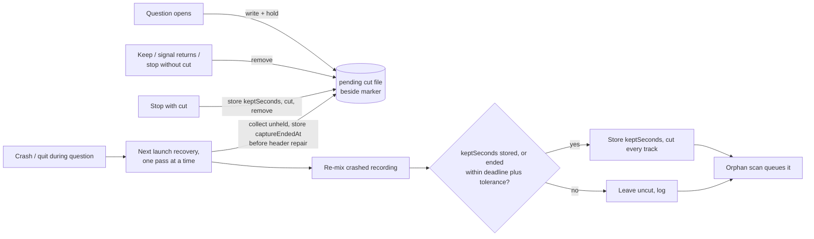

# Cut a recovered recording back when the app died during the meeting-end countdown

## Conversation Evidence

> issue #60 (filed 2026-10-06 from the gh-54 build): "Stürzt die App ab oder wird sie beendet, während der 2-Minuten-Countdown aus #54 läuft, holt die Wiederherstellung beim nächsten Start die Aufnahme **ungeschnitten** zurück. Damit landen die Countdown-Minuten (Raumaudio nach dem Meeting) doch im Transkript und Protokoll, entgegen der Entscheidung in #54"
> issue #60, Wunsch: "Den ausstehenden Schnittpunkt neben der Markierung der laufenden Aufnahme speichern, sobald der Countdown beginnt, und bei der Wiederherstellung anwenden; nach „Weiter aufnehmen“ oder zurückkehrendem Signal wieder entfernen."
> issue #60, Abnahme: "Countdown läuft, App wird hart beendet → nach Neustart wird die Aufnahme verarbeitet und endet am selben Punkt wie bei abgelaufenem Countdown."
> user (2026-10-07, selected): "A — Spec #60 + #73 now (Recommended)"

## Goal & Context

Since gh-54, a detected meeting whose signal disappears is not stopped at once: the app asks "Meeting seems to have ended" and records on for up to 2 minutes. If nobody answers, the saved recording is cut back to where the old automatic stop would have ended it (signal loss plus end grace), so the room audio recorded while asking is neither kept nor transcribed (owner decision D2 of gh-54). That guarantee holds only when the app is still running at the end of the countdown. If it crashes, is force-quit, loses power or is quit normally while the question is open, the next launch recovers the in-progress recording uncut, and the countdown minutes reach the transcript and protocol after all. This spec makes the cut point survive the process. [paraphrase]

A normal quit does not stop the recorder today (the app ends the recording abruptly and leaves it to the next launch's recovery), so every one of these endings reaches the same recovery path.

<!-- Source: 30% user / 50% [paraphrase] / 20% [inferred] -->

## Architecture & Data Models

- **The pending cut is a fact about one in-progress recording**, so it is stored with that recording's in-progress state: a small owner-only file in the recordings staging folder beside the recording's in-progress marker, named by and carrying the recording's stem. It is written when the meeting-end question opens, before the question is posted, and replaced whole (atomically) if a later question opens in the same recording. [paraphrase]
- **Every change to it is durable, not only atomic**, so it survives a power loss as well as a process death: a write goes to a temporary file that is fully synced to the disk, renamed over the target, and then the folder is synced; a removal unlinks the file and syncs the folder; the fallback that empties a file it could not remove truncates it and fully syncs it. A sync that fails makes the whole operation report failure, and the caller logs it as it logs any other failure of that operation. A write reports one of three outcomes: written; not published (it failed before the rename, so whatever was there before is untouched); or published but not synced (the new record is in place, only the folder sync failed). Because a failed write may still have published its record, the recorder remembers the stem and holds it **before** it writes, whatever the outcome, so a later Keep, returning signal or stop clears that record like any other. A removal likewise reports removed, removed but not synced, emptied, or failed.
- **It is its own file, not content in the in-progress marker.** The recorder removes the marker as soon as the stopped recording's mix exists, which is before the live cut runs, so a cut stored in the marker would vanish exactly in the window between stop and cut. The marker's age also anchors the reaping of dead markers, and rewriting it would change that age. Its name ends in neither `.wav` nor any audio-track suffix, so no scan of the staging folder (orphan scan, header repair, crash detection) mistakes it for a track or a crash signal.
- **Record shape** (these fields are the contract; nothing else is stored):

  | Field | Meaning |
  |---|---|
  | `version` | record format, `1` |
  | `stem` | the recording's stem, compared with the file's own name on read |
  | `cutAt` | the cut point gh-54 computed (signal loss plus end grace), wall clock |
  | `startedAt` | when the loop saw capture running, the origin gh-54's live cut measures from, wall clock |
  | `deadline` | when the countdown would end the recording unanswered, wall clock |
  | `captureEndedAt` | optional: when capture stopped, wall clock; set by the live stop or by the first recovery pass that sees the record, never changed afterwards |
  | `keptSeconds` | optional: the resolved cut on the recording's own timeline, seconds from its first frame; set before any track is cut, never changed afterwards |

  A record is valid only when its version is known, its stem matches the file name, `startedAt ≤ cutAt ≤ deadline`, and `keptSeconds`, when present, is positive.
- **Who writes and removes it.** The recorder owns the staging folder and the stem, so writing, updating and removing go through the recorder seam the watch loop already holds; the watch loop decides when. Settling the question without a cut (Keep recording, a returning signal) removes it. A stop that carries no cut (the question was settled, including by a Keep that arrived just before Stop Watching or together with the 4-hour cap) removes it **before** the recorder stops, so a stop that then fails can never hand a settled question's cut to recovery. A stop that carries a cut keeps it through the recorder's stop and removes it after the cut was applied or failed. A cut-carrying stop whose recording could not be finalized keeps it, because that recording's marker also survives for recovery.
- **The resolved cut is recorded before any track changes.** gh-54's placement reads the mix's current length, which the cut itself shortens, so computing it a second time on an already (or partly) cut recording would cut deeper. The live stop therefore writes `keptSeconds` and `captureEndedAt` into the stored cut before it cuts, and recovery writes `keptSeconds` before it cuts; whoever finds `keptSeconds` present applies exactly that and never recomputes it, so a cut interrupted or completed before the file's removal is finished, never deepened.
- **This process's hold.** While a recording of this process has a stored cut that its stop sequence has not settled yet (the recording is live, or stopped and not yet cut), the stem is held in a process-wide set. A stop that could not finalize its recording releases the hold, handing the stored cut to recovery with the marker. Recovery also runs on queue rebuilds while this process may be recording; it leaves held stored cuts alone and treats every other one as its own. No clock is involved in this decision.
- **One recovery pass at a time.** Staged recovery passes are serialized process-wide: a pass started while another is still running (a queue rebuilt by stopping and restarting watching) waits until the earlier one has finished, orphan scan included. No two passes ever cut, restore or queue the same recording concurrently, and the cut's fixed working-file names are never shared between two cuts.
- **Recovery applies it before the recording is queued.** The launch recovery of staged recordings first collects the stored cuts that are not held. For each one without `captureEndedAt` it reads when the recording's capture files were last written and stores that in the record, before it repairs headers or re-mixes anything (both rewrite the track files and move their modification times, and the re-mix creates files that did not exist during capture), so a later pass interrupted after the re-mix still has the original evidence. Once crashed recordings are re-mixed, for each collected recording it first puts back any original track (mix, app or microphone) that an earlier cut's rollback left under its hidden backup name while the track's own path is missing, whether or not a mix is present at that moment; only after that does it judge the recording (no mix but a marker: wait; no mix, no marker and no hidden original: stale). Then, for a recording that has a mix, it uses the stored `keptSeconds` if present, or else decides (below) and stores `keptSeconds` first, and cuts with gh-54's all-or-nothing cut; only then does the orphan scan queue it. Placement on the recovered audio uses gh-54's two-estimate rule (`RecordingCut.keptSeconds`, the later of "from the start" and "from the end" wins) with `captureEndedAt` as the stop time. That time is the last write of the files written during capture (the raw app temp and the microphone track, or, for an app-only recording stopped by the recorder before the crash, the app track; never the mix or the cut's hidden working files). It trails the audio's real end by the file write latency (well under a second), so the recovered cut can land up to that much before the live one would have, inside the end grace period (at least 1 s), never before the signal was lost. The recovered tracks are aligned at their file starts (the recovered job carries no microphone delay), so all of them are cut at the same timeline point.
- **A stored cut is only applied when its recording evidently ended inside the countdown.** This check runs only while `keptSeconds` is absent (a present one was resolved by a cut-carrying stop or an earlier pass). The countdown ends an unanswered recording at its deadline; a recording whose capture ended (`captureEndedAt`) more than a tolerance after the deadline was kept (Keep recording or a returning signal), so a stored cut that survived its removal is refused there instead of cutting a meeting that went on. The tolerance is 5 minutes: it covers the whole stop sequence of a recording up to the 4-hour cap (the poll after the deadline, the recorder's stop and mix build, and the live cut's copying), with margin.



## Edge Cases & Constraints

- A stored cut that belongs to another recording (its stem differs from its file name), that cannot be read or decoded, that has an unknown version or whose times are out of order is never applied; the recording is recovered uncut, the file is removed and the fact is logged.
- A cut point stored during a countdown whose signal then returned, or that the person answered with "Keep recording", must already be gone when a crash follows, so the whole recording is recovered. A failed removal falls back to emptying the file (an empty file never decodes, so it is never applied) and is logged; recovery also refuses any stored cut whose recording ran on past the deadline plus the tolerance. What remains possible is a removal and its fallback both failing and the app dying before the original deadline plus tolerance: both fail only when the staging folder has become unwritable, which also breaks the recording itself (A6). [paraphrase]
- The crash can fall between the recorder's stop (mix written, marker removed) and the live cut. The recording then has a mix and no marker, so only the orphan scan sees it; the stored cut must still be applied, which is why it outlives the stop and why recovery looks for stored cuts directly rather than only beside surviving markers.
- A crash after the live cut (or a recovery cut) but before the file's removal leaves an already cut recording with its stored cut and its `keptSeconds`; applying that same `keptSeconds` again leaves tracks that already end there as they are. The same holds when the crash fell inside the cut's swap and left some tracks cut and others not: re-applying the stored `keptSeconds` brings the rest to the same point. This holds when capture began before the loop saw it running, where recomputing would cut deeper.
- If writing `keptSeconds` fails, the cut still goes ahead (logged); a crash before the stored cut's removal then lets recovery recompute it from the shortened mix, which can remove up to the audio recorded before capture was reported running (normally well under a second, inside the end grace). This needs two failures and is accepted (A7).
- An app-only recording recovered in a pass that dies after the re-mix but before the cut: the next pass reads `captureEndedAt` from the record, not from the app track the re-mix just wrote, so it neither refuses the cut as "ran past the deadline" nor misplaces it.
- A stored cut whose recording has no mix yet but still has its in-progress marker is kept for a later recovery attempt (the re-mix failed this time). Hidden originals are put back before this judgment, so a mix that an earlier failed rollback left under its backup name counts as present once restored, and as not stale while it cannot be restored (the stored cut is then kept). Only a recording with no mix, no marker and no hidden original left is stale; its stored cut is removed and logged.
- A store whose record was published but whose folder sync failed is logged as a failed write, and the record is still cleared by a later Keep, returning signal or stop, because the recorder took the stem before writing; recovery after such a Keep finds nothing to apply.
- A cut that fails at recovery leaves the originals in place and the recording is queued uncut (R2's error case). If the cut's own rollback could not put an original back on its path, recovery moves it back from its hidden backup name before the orphan scan runs, so the scan still finds the recording. If that also fails, the stored cut is kept (the recording is not settled), the recording stays on disk under the backup name, the failure is logged, and every later pass first tries the restore again; the recording is never discarded, and it is queued once its tracks are back.
- A stored cut that would keep nothing (cut point at or before the audio's start) is refused by the cut as on the live path, and the recording is queued uncut.
- The orphan scan only queues recordings younger than 24 hours; a recording recovered later is still cut (its countdown minutes are not kept) but, as today, not queued.
- Clock: all stored times are wall clock, like gh-54's live cut. A clock step between the question and the recovery can move the estimate; the two-estimate rule then keeps more audio rather than less, and the deadline check errs toward leaving the recording uncut.
- Microphone-only and app-only recordings: the cut works with whichever tracks exist, as gh-54's does.
- Several recordings with stored cuts are handled one by one; one failing never blocks the others.
- Pause and resume (gh-46, planned): a recording paused during the meeting has less audio than wall-clock time, so the "from the start" estimate lands later on the audio and keeps more, never less; gh-60 does not depend on gh-46, and whichever lands second keeps the stored record consistent with how the live cut is placed.
- Privacy: the file holds times and the stem only, is owner-only like the recordings, and no log line carries the stem, a title or any meeting content.

## Acceptance Criteria

- **R1:** When the meeting-end question opens, the pending cut point is stored durably with the recording in progress before the question is posted and the countdown runs. Errors: a failed write is logged (error domain and code, no path) and the countdown proceeds as today (no worse than before this spec); a write that published its record but could not sync it is logged the same way and its record is still cleared by a later Keep, returning signal or stop. [paraphrase]
- **R2:** When the app ends for any reason while the question is open, the next launch's recovery cuts the recovered recording back to the stored cut point before it is processed, with the same result as an unanswered countdown: every saved track cut at the same point on the recording's timeline, placed by the live cut's two-estimate rule with the capture files' last write standing in for the stop (so on an ordinary recording it lands within a second of where the live cut would, inside the end grace period), and, where the recovered recording produces a record-only sidecar, its stop time at the cut (recovery produces none today; see Boundaries). Errors: if the cut fails, the recording is processed uncut and the failure is logged; the recording is never discarded (an original the cut could not put back is restored by recovery, and retried on every later pass until it is). A cut interrupted or already completed before a crash is finished at the same point on recovery, never cut deeper. [paraphrase]
- **R3:** "Keep recording" and a returning signal remove the stored cut point durably, so a crash afterwards recovers the whole recording. Errors: a failed removal is logged; recovery must then not cut a recording whose question was settled with Keep or a returning signal (see Edge Cases for the guards and the one remaining double-failure case). [paraphrase]
- **R4:** Every normal end of the recording (countdown expiry, "Stop now", Stop Watching, the 4-hour cap, and an end after "Keep recording") leaves no stored cut point behind once the recording is finalized, whether its cut succeeded, failed or was not needed; a stop that carries no cut removes it before the recorder stops. Errors: a cut-carrying stop whose recording could not be finalized keeps the stored cut and releases it to recovery; a failed removal is logged as in R3.
- **R5:** Recovery writes one line to the app's diagnostic log (the same sink as gh-54's stop lines) for every stored cut it settles: applied (with the seconds of audio removed and kept), refused (with the reason: unreadable, another recording, ran past the deadline, no known capture end, nothing to keep, stale), or failed (error domain and code, including an original that could not be restored). No line carries the recording's stem, a meeting title, participant names or transcript content. Errors: no error surface beyond the log write.

## Early proof point

Task gh-60-cut-a-recovered-recording-back-after-a.4 validates the core approach (a stored cut, collected at launch recovery before headers are repaired, places the cut on a re-mixed crashed recording at the point the live countdown would have cut, refuses one whose recording ran on past the deadline, and finishes an interrupted cut at the same point). It builds only on the stored-cut record of gh-60-cut-a-recovered-recording-back-after-a.1. If it fails, re-evaluate where the stop time comes from at recovery (stored progress instead of file modification times) before continuing with gh-60-cut-a-recovered-recording-back-after-a.2 and .3.

## Boundaries

- The live countdown, its notification and its answers stay exactly as gh-54 built them; this spec only adds persistence and its use at recovery.
- Recordings started manually have no meeting-end question and are untouched.
- Recovery keeps queuing every recovered recording for processing, record-only mode included, and writes no record-only sidecar; making a crash-recovered recording honour record-only mode is a separate, pre-existing gap and not part of this spec.
- A crash in the middle of the live cut itself is gh-54's territory beyond what Edge Cases says (the hidden working files it may leave are not cleaned up here).
- No live end-to-end lane that kills the app during a countdown is added here; the behaviour is proven with WAV-fixture tests through the real recovery entry point.
- `CLAUDE.md` is not edited (fork rule); the architecture doc gets the new file and the recovery step.

## Decision Context

- **D1 · An unanswered countdown cuts the recording back to signal loss plus end grace, and this holds across a crash.** why: owner decision D2 of gh-54 (room audio after a meeting is neither kept nor transcribed) would otherwise fail exactly when the app dies during the 2 minutes. · status: active [owner-ratified 2026-10-07]
- **A1 · A cut point whose removal failed after "Keep recording" must not be applied at recovery.** flip at: plan finds the removal cannot fail independently of the recording's own state · test: R3's error case · status: superseded by A6 [agent-assumed 2026-10-07]
- **A2 · The pending cut is its own owner-only file beside the in-progress marker, not content inside the marker.** flip at: the recorder stops removing the marker before the live cut runs · test: a crash between stop and cut still recovers a cut recording · alternatives: marker content, rejected because stop removes the marker before the cut and its age anchors marker reaping · status: active [agent-inferred 2026-10-07]
- **A3 · Recovery applies a stored cut only when the recording's capture files stopped being written no later than the countdown deadline plus 5 minutes.** flip at: the owner prefers cutting even when the recording ran on · test: a stored cut beside a recording that ran past the deadline plus tolerance is refused and logged · status: active [agent-assumed 2026-10-07]
- **A4 · Recovery skips a stored cut while this process still holds it (its recording is live, or stopped and not yet settled) and treats every other one as its own.** flip at: recovery stops running during this process's recordings · test: a recovery pass during a live countdown leaves the stored cut untouched; one after a failed stop applies it · alternatives: "written before this process started" by modification time, rejected because a clock step can misjudge it and a failed stop's cut would wait for the next launch · status: active [agent-inferred 2026-10-07]
- **A5 · Recovery writes no record-only sidecar, so R2's sidecar clause has nothing to act on there; a recovered recording is processed in every mode, as today.** flip at: the owner wants crash-recovered recordings to honour record-only mode (separate issue) · test: no recovery code path writes a sidecar · status: active [agent-inferred 2026-10-07]
- **A6 · A failed removal after "Keep recording" or a returning signal is covered by emptying the file and by A3's deadline check; the remaining case (removal and emptying both fail, then the app dies before the deadline plus tolerance) is accepted.** flip at: the owner requires no residual case at all · test: a removal failure empties the file and logs; a stored cut beside a recording that ran past the deadline plus tolerance is refused · status: active [agent-inferred 2026-10-07]
- **A7 · If writing the resolved `keptSeconds` fails, the cut still goes ahead; a later crash before the stored cut's removal can then let recovery recompute it from the shortened mix and remove up to the audio recorded before capture was reported running.** flip at: the owner wants the cut skipped whenever its resolution cannot be stored · test: a forced `keptSeconds` write failure logs and still cuts · alternatives: skip the cut when the write fails, rejected because a crash mid-cut would then leave tracks cut at different points with nothing to finish them · status: active [agent-inferred 2026-10-07]
- **A8 · Staged recovery passes run one at a time in the process.** flip at: recovery gains its own per-recording ownership · test: two passes started back to back on the same staging folder cut and queue the recording once · alternatives: per-recording claims in the hold set, rejected because the orphan scan of an overlapping pass could still queue a recording mid-cut · status: active [agent-inferred 2026-10-07]
DIRECTION: GO — four M-sized tasks on existing seams (recorder, launch recovery, gh-54's cut), no new subsystem; nothing an existing tool gives, and the stored record carries gh-46's pause work without change.

FIT: GO · 2026-10-09 · base 47c550ad · engine flow-next 8.1.1 · gh-73, gh-94 and gh-4's cut-back remix landed on the same seams and claim none of this scope; the recovery entry moved to PipelineController+ProductionEnvironment.swift and gained levelBalance (tasks re-pinned); remixing a recovered cut as the live path does since gh-4 A9 is a follow-up, not built here

## Memory findings

| Track | Category | Entry | Why relevant |
|---|---|---|---|
| knowledge | workflow | `lint-locally-with-the-cached-pinned-2026-10-06` | how to run the pinned linters locally |
| knowledge | workflow | `run-swift-tests-locally-redirect-models-2026-10-06` | test runs need a redirected home and a log file; known environmental failures |

- Lint with the cached pinned SwiftFormat/SwiftLint, never a global install.
- Run focused tests with `CFFIXED_USER_HOME` and read the log file; never pipe a test run.

## Quick commands

```bash
cd app/MeetingTranscriber && CFFIXED_USER_HOME=/tmp/mt-gh60-home swift test --parallel --filter 'PendingRecordingCut|RecoveredCut|DualSourceRecorder|WatchLoopMeetingEnd|StagedRecovery|RecordingCut' > /tmp/mt-gh60-tests.log 2>&1; echo "exit $?"
```

```bash
PATH="$HOME/Library/Caches/MeetingTranscriber/lint-tools/bin:$PATH" ./scripts/lint.sh
```

## Requirement coverage

| Req | Description | Task(s) | Gap justification |
| --- | --- | --- | --- |
| R1 | When the meeting-end question opens, the pending cut point is stored durably with the recording in progress before the question is posted and the countdown runs. Errors: a failed write is logged (error domain and code, no path) and the countdown proceeds as today (no worse than before this spec); a write that published its record but could not sync it is logged the same way and its record is still cleared by a later Keep, returning signal or stop. | gh-60-cut-a-recovered-recording-back-after-a.1, gh-60-cut-a-recovered-recording-back-after-a.2, gh-60-cut-a-recovered-recording-back-after-a.3 | — |
| R2 | When the app ends for any reason while the question is open, the next launch's recovery cuts the recovered recording back to the stored cut point before it is processed, with the same result as an unanswered countdown: every saved track cut at the same point on the recording's timeline, placed by the live cut's two-estimate rule with the capture files' last write standing in for the stop (so on an ordinary recording it lands within a second of where the live cut would, inside the end grace period), and, where the recovered recording produces a record-only sidecar, its stop time at the cut (recovery produces none today; see Boundaries). Errors: if the cut fails, the recording is processed uncut and the failure is logged; the recording is never discarded (an original the cut could not put back is restored by recovery, and retried on every later pass until it is). A cut interrupted or already completed before a crash is finished at the same point on recovery, never cut deeper. | gh-60-cut-a-recovered-recording-back-after-a.4 | — |
| R3 | "Keep recording" and a returning signal remove the stored cut point durably, so a crash afterwards recovers the whole recording. Errors: a failed removal is logged; recovery must then not cut a recording whose question was settled with Keep or a returning signal (see Edge Cases for the guards and the one remaining double-failure case). | gh-60-cut-a-recovered-recording-back-after-a.1, gh-60-cut-a-recovered-recording-back-after-a.3, gh-60-cut-a-recovered-recording-back-after-a.4 | — |
| R4 | Every normal end of the recording (countdown expiry, "Stop now", Stop Watching, the 4-hour cap, and an end after "Keep recording") leaves no stored cut point behind once the recording is finalized, whether its cut succeeded, failed or was not needed; a stop that carries no cut removes it before the recorder stops. Errors: a cut-carrying stop whose recording could not be finalized keeps the stored cut and releases it to recovery; a failed removal is logged as in R3. | gh-60-cut-a-recovered-recording-back-after-a.2, gh-60-cut-a-recovered-recording-back-after-a.3 | — |
| R5 | Recovery writes one line to the app's diagnostic log (the same sink as gh-54's stop lines) for every stored cut it settles: applied (with the seconds of audio removed and kept), refused (with the reason: unreadable, another recording, ran past the deadline, no known capture end, nothing to keep, stale), or failed (error domain and code, including an original that could not be restored). No line carries the recording's stem, a meeting title, participant names or transcript content. Errors: no error surface beyond the log write. | gh-60-cut-a-recovered-recording-back-after-a.4 | — |

