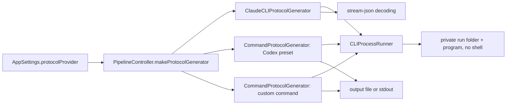

# Protocol via Codex CLI and a custom command

## Conversation Evidence

> issue #7 (Problem, translated): "For the protocol there are three providers: Claude CLI, an OpenAI-compatible interface, none. Other command-line tools (Codex CLI, Gemini CLI, `ollama run`, `llm`, `mlx_lm.generate`, llama.cpp) cannot be plugged in."
> issue #7 (Wish 1): "More ready-made CLI providers, at least Codex CLI (`codex exec -`, reads the prompt from stdin)."
> issue #7 (Wish 2): "'Custom command': a freely configurable call with placeholders, for example `ollama run qwen3:32b` or `mlx_lm.generate --model {model} --prompt-file {prompt_file}`. Placeholders: `{model}`, `{prompt_file}`, `{transcript_file}`, `{output_file}`. Without placeholders, prompt and transcript go via stdin and the protocol comes back via stdout. Timeout and error message as with the Claude provider."
> issue #7 (Why): "Local models without a server: with `ollama run`, `mlx_lm` or llama.cpp the transcript stays on the computer, a precondition for confidential sessions. Whether a command goes online the app cannot check; so the UI says clearly: 'What the command does with the transcript is up to the command.'"
> issue #7 (Technical notes): "`ClaudeCLIProtocolGenerator` already starts a process and writes via stdin. Its core can be generalised into a general CLI generator; Claude and Codex become presets of it." · "Store arguments as a list and run them without a shell (no shell injection via file names)."
> issue #7 (Acceptance): "Codex CLI chosen as provider → a protocol is generated." · "Custom command `ollama run <model>` → a protocol is generated without the app itself going online."
> coordinator triage 2026-10-06: "Follow the issue: a Codex CLI provider (prompt via stdin) and a 'Custom command' provider with placeholders {model}, {prompt_file}, {transcript_file}, {output_file}; without placeholders prompt+transcript go via stdin and the protocol comes back on stdout; timeout and error reporting like the Claude CLI provider; arguments stored as a list and run without a shell."
> coordinator triage 2026-10-06: "Lessons already merged into the Claude CLI generator must carry over to every CLI provider: it starts in a private working directory (issue #30: no macOS folder-access prompts for Desktop/Documents/Downloads/iCloud), and transcripts must not land in the CLI's own session store (issue #33)."
> coordinator triage 2026-10-06: "Generalise ClaudeCLIProtocolGenerator's process core into a shared CLI runner; Claude and Codex become presets of it. Whole feature is `#if !APPSTORE` (sandbox forbids subprocesses). Profiles (#6) come later: no profile work here."

## Goal & Context

<!-- Source: 35% user / 35% [paraphrase] / 30% [inferred] -->

Today a protocol can be written by the Claude CLI, by an OpenAI-compatible server, or not at all. People who use another command-line tool for language models (Codex CLI, `ollama run`, `mlx_lm.generate`, llama.cpp, `llm`) cannot use it, and a local model run as a command, without a server, is the simplest way to keep a confidential meeting's transcript on the computer. [paraphrase]

This spec adds two providers to Settings → Output → LLM Provider in the Homebrew build: "Codex CLI", a ready-made preset, and "Custom Command", where the user enters the program and its arguments with placeholders. Both run through one shared process core that the Claude CLI provider moves onto as well, so every CLI provider gets the same private working directory, timeout, failure handling and logging rules. [paraphrase]

Two privacy rules already learned on the Claude provider apply to every CLI provider: the program starts in a private empty folder rather than the app's working directory (otherwise macOS asks the user for Desktop, Documents, Downloads and iCloud Drive on the app's behalf, issue #30), and the transcript must not end up in the tool's own session store (issue #33). Codex keeps every `codex exec` run under `~/.codex/sessions` unless it is started with `--ephemeral` ("Run without persisting session files to disk", read from `codex exec --help` of codex-cli 0.154.0 on 2026-10-06), so the Codex preset always passes that flag. [inferred]

## Architecture & Data Models



**Shared runner (new, `CLIProcessRunner`, whole file `#if !APPSTORE`).** Starts one program with a fixed argument vector through `Process` (never a shell), in a working directory it is given, with an environment it is given, feeds optional bytes on stdin, collects stdout and stderr, enforces a wall-clock timeout and returns the exit status with the collected bytes. It never interprets output, and its pipe I/O is event-driven rather than a blocking read on Swift's cooperative thread pool, so a run that ends (normally, by timeout or by the output cap) leaves no thread waiting on a pipe, even when a background process the program started still holds one open. It owns what the Claude generator has today and every CLI provider needs: the install-location search paths (`searchPaths`), the environment with `CLAUDECODE` removed and the search paths prepended to `PATH` (`buildEnvironment`), and the fresh owner-only run folder (`makeWorkingDirectory`). [paraphrase]

**Claude preset.** `ClaudeCLIProtocolGenerator` keeps everything that is specific to Claude: the `--help` probe for `--no-session-persistence` and the project-folder cleanup, the optional API key, the stream-json parsing and the result-event failure reason. Only the process handling moves to the runner. Its arguments, messages and log lines stay as they are. [paraphrase]

**Command presets (new, `CommandProtocolGenerator`, whole file `#if !APPSTORE`).** One generator for "Codex CLI" and "Custom Command": an argument list in which placeholders are replaced, a tool label used in messages ("Codex CLI" / "Custom command"), and an optional function that extracts a content-free failure reason from the program's output (Codex only). Codex is a built-in argument list; the custom command is the user's list. Both build the prompt with the same shared helper as the Claude generator (instructions, then the transcript), and the 10-minute default timeout belongs to the runner. [inferred]

**Placeholders (custom command; Codex uses `{output_file}` internally).** Substituted inside each argument after the program (so `--prompt-file={prompt_file}` works), in a single pass, so a substituted value is never expanded again. An unknown `{name}` is left as typed. [paraphrase]

| Placeholder | Becomes | Effect |
|---|---|---|
| `{model}` | the custom command's model setting | none beyond the text |
| `{prompt_file}` | path of a file holding the full prompt: instructions followed by the transcript, the same bytes the stdin mode sends | nothing is sent on stdin |
| `{transcript_file}` | path of a file holding the transcript alone | nothing is sent on stdin |
| `{output_file}` | path where the program must write the protocol | the protocol is read from that file; stdout is ignored |

Without `{prompt_file}` and `{transcript_file}`, the full prompt goes to stdin; without `{output_file}`, the protocol is read from stdout. All files live in the run folder with owner-only permissions; input files are written only when their placeholder is used. [paraphrase]

**Codex preset arguments (exact).** `codex exec --json --ephemeral --skip-git-repo-check --sandbox read-only --output-last-message {output_file} -`, the program `codex` resolved through the runner's search paths, the full prompt on stdin. `--skip-git-repo-check` because the run folder is not a git repository and `codex exec` refuses to run outside one without it; `--sandbox read-only` because the transcript is untrusted input and a user's Codex configuration may allow writes; `--json` so a failed run's reason can be read from Codex's own error events. Model, reasoning effort and login come from the user's Codex configuration. [inferred]

**Settings (Homebrew build only).** `ProtocolProvider` gains `codexCLI` ("Codex CLI") and `customCommand` ("Custom Command"), both `#if !APPSTORE` like `claudeCLI`. `AppSettings` gains `customCommandArguments: [String]` (default empty; one entry per line the user typed, stored losslessly) and `customCommandModel: String` (default empty), persisted under keys of the same name. At run time each entry is trimmed of surrounding whitespace and empty entries are dropped; the first remaining entry is the program. [inferred]

**Errors.** New `ProtocolError` cases, `#if !APPSTORE`, each carrying the tool label: program not found, exited with a non-zero code (with an optional content-free reason), timed out, produced no protocol, wrote too much output, and not configured (no command; `{model}` used with no model set). Their text is content-free by construction, because the pipeline's protocol stage logs every generation error's description at `.public`. [inferred]

## Edge Cases & Constraints

- Program resolution for the custom command: an absolute path is used as is, a leading `~/` is expanded to the home directory, a bare name is looked up in the runner's search paths and then in the child's `PATH`; anything else (a relative path such as `bin/tool`, a name that is not found) fails with the not-found error before anything is started. The Claude preset keeps its `/usr/bin/env` fallback unchanged. [inferred]
- The stdout and stderr of Codex and custom commands may contain meeting content (a command can echo its input, Codex's human-readable output repeats the prompt), so they are logged only at `.private` and never become part of an error's text. Argument values are never logged at `.public` either: a user's command line may contain a key. [inferred]
- A program that exits without reading stdin (a typo, a usage error) must not take the app down: the stdin pipe's write end has `F_SETNOSIGPIPE` set and the write uses the throwing API, as today. [inferred]
- The timeout is wall-clock and covers a program that prints nothing: today the Claude generator checks its deadline only when a chunk of output arrives, so a CLI that hangs silently is never stopped. On timeout the program gets SIGTERM, then SIGKILL one second later, as the help probe already does. [inferred]
- Output is collected for at most two seconds after the program exits, so a background process the program left behind holding stdout open neither holds up nor fails the run. [inferred]
- Stdout above 32 MiB stops the program and fails the run (a misconfigured command such as `cat /dev/zero` would otherwise exhaust memory, crash the app, and the restored job would crash it again on relaunch); stderr keeps its first 1 MiB and discards the rest. [inferred]
- The output file is read only if it is a regular file at the expected path inside the run folder: it is opened without following a symlink and without blocking (so a FIFO cannot hang the run), checked to be a regular file on the open descriptor, and read up to the 32 MiB cap from that descriptor; anything else counts as no protocol. [inferred]
- The program's output is decoded as UTF-8 with invalid sequences replaced; the protocol is trimmed and an empty result is an error, as for Claude. [paraphrase]
- An installed Codex too old to know `--ephemeral` rejects the option and the run fails with a hint to update Codex; it never runs without the flag. [inferred]
- App Store build: a stored `codexCLI` or `customCommand` value does not decode and the provider falls back to the default, exactly as a stored `claudeCLI` does today. [inferred]
- A crash in the middle of a run can leave its run folder in the per-user temporary directory (owner-only; macOS removes unused items there after three days). At that point the same transcript already sits in the output folder, so this adds no new exposure. [inferred]
- The help probe (`readHelp`) keeps its own bounded, file-based runner and is not moved. [inferred]

### Verification

- Fake programs are `#!/bin/sh` scripts written to a temporary path, as the Claude generator's tests already do; they report what they received (arguments, stdin, working directory, files) or misbehave on purpose (exit early, hang, ignore SIGTERM, spew output, leave a background process). [inferred]
- Timeout and output cap are injectable, so the timeout and cap tests run in seconds. Prompt tests pass their own prompt file to `ProtocolGenerator.buildSystemPrompt` so the developer's custom prompt never changes the result. [inferred]
- Every existing `ClaudeCLIProtocolGenerator*Tests` passes after the move with no edits beyond renamed symbols; they are the regression guard for the Claude preset. [inferred]
- Both variants build: the Homebrew build with the new providers, the App Store build (`-Xswiftc -DAPPSTORE`) without them. [inferred]
- A real Codex run and a real `ollama run` belong to the owner (his Codex login; ollama is not installed); they are human checks, not tasks. [inferred]

## Acceptance Criteria

- **R1:** With "Codex CLI" selected, a finished transcript produces a protocol: the app runs `codex exec --json --ephemeral --skip-git-repo-check --sandbox read-only --output-last-message <file> -` with the full prompt on stdin, reads the protocol from that file and saves it like any other protocol. Errors: Codex not found, a non-zero exit (carrying Codex's own error message from its JSON error events when there is one), a Codex that rejects an option (hint to update Codex), a missing or empty output file, and a timeout each fail the protocol with the transcript kept and the usual "Protocol generation failed — transcript saved" warning. [paraphrase]
- **R2:** With "Custom Command" selected, the app runs the stored argument list (first entry the program, entries trimmed, empty entries dropped) and applies the placeholder rules of the table above: `{model}`, `{prompt_file}` (instructions and transcript), `{transcript_file}` (transcript only), `{output_file}`; without a file-input placeholder the full prompt goes to stdin, without `{output_file}` the protocol is read from stdout. Errors: no command set, `{model}` used with no model set, program not found, a non-zero exit, a missing or empty output, and a timeout each fail the protocol with the transcript kept and the usual warning. [paraphrase]
- **R3:** No shell is involved: an argument or placeholder value containing spaces, quotes, `;`, `|`, `$(…)` or backticks reaches the program as exactly one unchanged argument, nothing else is executed, and a substituted value is never expanded again. Errors: none beyond R2. [paraphrase]
- **R4:** Every CLI provider (Claude, Codex, custom) starts its program in a new owner-only (0700) folder under the per-user temporary directory, never in the app's working directory; at start the folder holds nothing except the input files that run's placeholders name (Claude's and a stdin-only command's folder is empty). The prompt, transcript and output files a command uses exist only in that folder; the input files the app writes are owner-only (0600), the output file the program creates is protected by the folder's 0700 mode, and the folder is removed when the run ends, whether it succeeded or failed. Errors: a folder that cannot be created fails the protocol with the transcript kept, never a fallback to the app's working directory. [paraphrase]
- **R5:** Every CLI run is stopped after 10 minutes of wall-clock time even when it prints nothing (SIGTERM, SIGKILL one second later) and fails with a timeout error naming the tool; a program that exits without reading its input, leaves a background process holding its output, or writes more than 32 MiB to stdout ends the run cleanly without crashing or hanging the app. Errors: the public error text of Codex and custom-command failures holds only the tool label, the program's file name, the exit code and Codex's own error message; their stdout and stderr appear only in `.private` log lines. [inferred]
- **R6:** The Claude CLI provider runs on the shared runner with unchanged behaviour: the same arguments (including `--no-session-persistence` when the CLI lists it), API-key handling, private working directory, project-folder cleanup and failure messages, and a hung Claude CLI that prints nothing now times out after 10 minutes. Errors: as today (`cliNotFound`, `cliFailed` with the result-event or stderr reason, `timeout`, `emptyProtocol`). [paraphrase]
- **R7:** Settings → Output → LLM Provider offers "Codex CLI" and "Custom Command" in the Homebrew build. Codex shows a note that it uses the model and login from Codex's own configuration and keeps no session of the run. Custom Command shows a multi-line command editor (one argument per line, first line the program), a model field used for `{model}`, a short explanation of the placeholders and of stdin/stdout, and the line "What the command does with the transcript is up to the command." Errors: the App Store build offers neither provider and a stored value falls back to the default provider. [paraphrase]

## Early proof point

Task gh-7-protocol-via-codex-cli-and-a-custom.1 validates the core approach (one shared runner that starts a program without a shell in a private folder, bounds it by a wall-clock timeout and an output cap, survives a program that ignores its stdin, and carries the Claude CLI provider with every existing Claude test green). If it fails, re-evaluate whether the Claude provider should keep its own process code and only the new providers share a runner, before continuing with gh-7-protocol-via-codex-cli-and-a-custom.2+.

## Quick commands

```bash
cd app/MeetingTranscriber && CFFIXED_USER_HOME=/private/tmp/mt-gh7-home swift test --parallel --filter 'CLIProcessRunnerTests|ClaudeCLIProtocolGenerator|CommandProtocolGeneratorTests|CommandTemplateTests' > /private/tmp/mt-gh7-test.log 2>&1; echo "exit $?"
cd app/MeetingTranscriber && swift build -Xswiftc -DAPPSTORE --scratch-path /private/tmp/mt-gh7-appstore-build > /private/tmp/mt-gh7-appstore.log 2>&1; echo "exit $?"
```

## Boundaries

- Profiles (#6) are out: one Codex preset and one custom command, no per-use-case sets. [paraphrase]
- Codex gets no settings of its own (no binary picker, no model field): model, reasoning effort and login come from Codex's configuration, and anything else can be run as a custom command. Follow-up if real use asks for a model field. [inferred]
- No further presets (Gemini CLI, `llm`, `mlx_lm`, llama.cpp); the custom command covers them. Follow-up. [inferred]
- No "Test command" button and no inline validation beyond what R2's errors report. Follow-up. [inferred]
- The job warning stays the generic "Protocol generation failed — transcript saved"; the reason goes to the diagnostic log, as for Claude today. Showing the reason in the menu is a follow-up. [inferred]
- The 10-minute timeout is fixed for every CLI provider; a setting is a follow-up if local models need longer. [inferred]
- The OpenAI-compatible provider, the help probe, cancelling a running protocol run, and the `/state` RPC snapshot (it reports the provider's raw value only; no command or model is exposed) are unchanged. [inferred]
- Whether Codex's own log database (`~/.codex/logs_*.sqlite`) records prompt text could not be checked without running Codex; it is a human check, and a follow-up if it does. Removing run folders left behind by a crash is a follow-up. [inferred]
- `CLAUDE.md` and `AGENTS.md` are not edited (fork rule); the provider lists in `docs/architecture-macos.md` and `README.md` are. [inferred]

## Decision Context

- **D1 · Add a ready-made Codex CLI provider and a free "Custom Command" provider, Homebrew build only.** why: other CLI tools cannot be used today, and local models run as commands keep transcripts on the computer; the App Store sandbox forbids subprocesses (issue #7, coordinator triage 2026-10-06) · status: active [owner-stated 2026-10-06]
- **D2 · Store the custom command's arguments as a list and run them without a shell, with the placeholders {model}, {prompt_file}, {transcript_file}, {output_file}; without them the prompt goes to stdin and the protocol comes from stdout.** why: no shell injection through file names (issue #7, technical notes and wish 2) · status: active [owner-stated 2026-10-06]
- **D3 · Timeout and error reporting work as for the Claude CLI provider.** why: issue #7 wish 2 asks for it explicitly · status: active [owner-stated 2026-10-06]
- **D4 · Every CLI provider starts in a private run folder and keeps the transcript out of the tool's session store; Codex always runs with --ephemeral.** why: the lessons of issues #30 and #33 must carry over (coordinator triage 2026-10-06) · status: active [owner-stated 2026-10-06]
- **D5 · Generalise the Claude process core into one shared runner; Claude and Codex become presets of it.** why: issue #7 technical notes, repeated in the coordinator triage 2026-10-06 · status: active [owner-stated 2026-10-06]
- **D6 · The custom command's settings show "What the command does with the transcript is up to the command."** why: the app cannot tell whether a command goes online (issue #7) · status: active [owner-stated 2026-10-06]
- **A1 · The custom command is edited one argument per line in a multi-line editor and stored as that list, not typed as one line with quoting rules.** flip at: the owner prefers a single command line with quotes, which needs a tokenizer and a draft field · test: the editor writes `ollama`/`run`/`qwen3:32b` lines to `customCommandArguments` as three entries · status: active [agent-assumed 2026-10-06]
- **A2 · {prompt_file} holds the full prompt (instructions plus transcript, the stdin bytes) and {transcript_file} the transcript alone; using either sends nothing on stdin.** evidence: the issue's example `mlx_lm.generate --prompt-file {prompt_file}` takes no other input, so that file must carry everything · flip at: the owner wants {prompt_file} to hold the instructions only · test: placeholder tests compare the prompt file with the stdin bytes of a run without placeholders · status: active [agent-inferred 2026-10-06]
- **A3 · The Codex preset is the fixed argument list of R1 with no settings of its own; model, reasoning effort and login come from the user's Codex configuration.** flip at: real use needs a model or effort choice inside the app · test: the Codex argument-list test pins the exact vector · status: active [agent-assumed 2026-10-06]
- **A4 · A Codex too old for --ephemeral fails with an update hint instead of running with its session store; there is no help probe for Codex.** flip at: the owner wants old Codex versions to run with a warning, as the Claude provider does · test: a fake codex that rejects --ephemeral fails with the hint · status: active [agent-assumed 2026-10-06]
- **A5 · Stdout and stderr of Codex and custom commands are treated as meeting content: .private logs only, never in an error's text.** evidence: the protocol stage logs every generation error's description at .public · flip at: a tool's stderr is proven content-free and its reason is wanted in the log · test: a failing fake command that prints the transcript to stderr yields an error whose description lacks it · status: active [agent-inferred 2026-10-06]
- **A6 · One fixed 10-minute wall-clock timeout and a 32 MiB stdout cap for every CLI provider, with no setting.** flip at: a local model needs longer than 10 minutes for a long meeting · test: timeout and cap tests with injected limits · status: active [agent-assumed 2026-10-06]

Maintainability (plan review): duplication - the full-prompt assembly (`buildSystemPrompt(...) + transcript`) was repeated in the Claude and command generators, now one shared helper; structure - the command generator took its default timeout from the Claude generator, now the runner owns the default

## Resolved via Research
<!-- provenance: plan on 2026-10-06; the planning session could not dispatch scout subagents, so the planner ran the docs, practice and docs-gap research inline (read-only) -->

### docs-scout
- **codex-cli 0.154.0, `codex exec`** — a prompt of `-` (or none) is read from stdin; `--ephemeral` runs without persisting session files to disk; `--skip-git-repo-check` allows running outside a git repository; `--sandbox read-only|workspace-write|danger-full-access` caps what model-generated commands may do; `--json` prints events to stdout as JSONL; `-o/--output-last-message <FILE>` writes the agent's last message to a file; `-m/--model` and `-c key=value` override the user's `config.toml`. Source: local `codex exec --help`, read 2026-10-06
- **`codex exec --json` event stream** — a real run (this plan's own Codex review, 2026-10-06) emitted `thread.started`, `turn.started`, `item.started`/`item.completed` with item types `agent_message`, `command_execution` and `web_search`, and `turn.completed`; the failure events `turn.failed` (`error.message`) and `error` (`message`) are taken from Codex's non-interactive documentation and were not observed. Source: https://developers.openai.com/codex/noninteractive/ and the plan-review log
- **Codex home layout** — `~/.codex` holds `sessions/` (one file per non-ephemeral run), `logs_2.sqlite` (a `logs` table with a `feedback_log_body` text column), `memories_1.sqlite`, `history.jsonl` and `hooks.json`; whether an `--ephemeral` exec run writes prompt text to the log database is not settled without running Codex. Source: local `ls ~/.codex` and `sqlite3 -readonly ~/.codex/logs_2.sqlite .schema`, 2026-10-06 (names and schema only, no content read)

### practice-scout
- **Gotcha:** writing stdin to a program that has already exited is a write to a broken pipe; whether Foundation's `Pipe` already suppresses SIGPIPE for it is not documented, and an unsuppressed SIGPIPE kills the app. Setting `F_SETNOSIGPIPE` on the write end makes the write fail with EPIPE instead, which the throwing `FileHandle.write(contentsOf:)` turns into a Swift error; the audiotap tests use the same per-descriptor flag because `signal(SIGPIPE, SIG_IGN)` would be process-wide. Source: `tools/audiotap/Tests/HelpersTests.swift:117`
- **Gotcha:** a background process a wrapper script leaves behind keeps an inherited stdout pipe open, so reading it "to EOF" never ends; the help probe already bounds its wait for this reason. Source: `app/MeetingTranscriber/Sources/ClaudeCLIProtocolGenerator+SessionPersistence.swift:86`
- **Gotcha:** the current Claude read loop checks its timeout only between output chunks, so a CLI that prints nothing is never stopped. Source: `app/MeetingTranscriber/Sources/ClaudeCLIProtocolGenerator.swift:213`

### docs-gap-scout
- **Docs that must change:** `docs/architecture-macos.md` — the provider list in the overview diagram and "Provider Selection" names only Claude CLI, OpenAI-compatible and none. Source: `docs/architecture-macos.md:75`, `docs/architecture-macos.md:585`
- **Docs that must change:** `README.md` — the feature list and the Output settings row list the providers. Source: `README.md:95`, `README.md:256`

## Requirement coverage

| Req | Description | Task(s) | Gap justification |
| --- | --- | --- | --- |
| R1 | With "Codex CLI" selected, a finished transcript produces a protocol: the app runs `codex exec --json --ephemeral --skip-git-repo-check --sandbox read-only --output-last-message <file> -` with the full prompt on stdin, reads the protocol from that file and saves it like any other protocol. Errors: Codex not found, a non-zero exit (carrying Codex's own error message from its JSON error events when there is one), a Codex that rejects an option (hint to update Codex), a missing or empty output file, and a timeout each fail the protocol with the transcript kept and the usual "Protocol generation failed — transcript saved" warning. | gh-7-protocol-via-codex-cli-and-a-custom.2 | — |
| R2 | With "Custom Command" selected, the app runs the stored argument list (first entry the program, entries trimmed, empty entries dropped) and applies the placeholder rules of the table above: `{model}`, `{prompt_file}` (instructions and transcript), `{transcript_file}` (transcript only), `{output_file}`; without a file-input placeholder the full prompt goes to stdin, without `{output_file}` the protocol is read from stdout. Errors: no command set, `{model}` used with no model set, program not found, a non-zero exit, a missing or empty output, and a timeout each fail the protocol with the transcript kept and the usual warning. | gh-7-protocol-via-codex-cli-and-a-custom.2 | — |
| R3 | No shell is involved: an argument or placeholder value containing spaces, quotes, `;`, `\|`, `$(…)` or backticks reaches the program as exactly one unchanged argument, nothing else is executed, and a substituted value is never expanded again. Errors: none beyond R2. | gh-7-protocol-via-codex-cli-and-a-custom.2 | — |
| R4 | Every CLI provider (Claude, Codex, custom) starts its program in a new owner-only (0700) folder under the per-user temporary directory, never in the app's working directory; at start the folder holds nothing except the input files that run's placeholders name (Claude's and a stdin-only command's folder is empty). The prompt, transcript and output files a command uses exist only in that folder; the input files the app writes are owner-only (0600), the output file the program creates is protected by the folder's 0700 mode, and the folder is removed when the run ends, whether it succeeded or failed. Errors: a folder that cannot be created fails the protocol with the transcript kept, never a fallback to the app's working directory. | gh-7-protocol-via-codex-cli-and-a-custom.1, gh-7-protocol-via-codex-cli-and-a-custom.2 | — |
| R5 | Every CLI run is stopped after 10 minutes of wall-clock time even when it prints nothing (SIGTERM, SIGKILL one second later) and fails with a timeout error naming the tool; a program that exits without reading its input, leaves a background process holding its output, or writes more than 32 MiB to stdout ends the run cleanly without crashing or hanging the app. Errors: the public error text of Codex and custom-command failures holds only the tool label, the program's file name, the exit code and Codex's own error message; their stdout and stderr appear only in `.private` log lines. | gh-7-protocol-via-codex-cli-and-a-custom.1, gh-7-protocol-via-codex-cli-and-a-custom.2 | — |
| R6 | The Claude CLI provider runs on the shared runner with unchanged behaviour: the same arguments (including `--no-session-persistence` when the CLI lists it), API-key handling, private working directory, project-folder cleanup and failure messages, and a hung Claude CLI that prints nothing now times out after 10 minutes. Errors: as today (`cliNotFound`, `cliFailed` with the result-event or stderr reason, `timeout`, `emptyProtocol`). | gh-7-protocol-via-codex-cli-and-a-custom.1 | — |
| R7 | Settings → Output → LLM Provider offers "Codex CLI" and "Custom Command" in the Homebrew build. Codex shows a note that it uses the model and login from Codex's own configuration and keeps no session of the run. Custom Command shows a multi-line command editor (one argument per line, first line the program), a model field used for `{model}`, a short explanation of the placeholders and of stdin/stdout, and the line "What the command does with the transcript is up to the command." Errors: the App Store build offers neither provider and a stored value falls back to the default provider. | gh-7-protocol-via-codex-cli-and-a-custom.3 | — |
