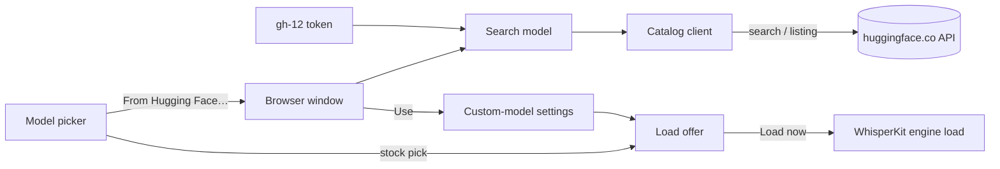

# Find and preload models from Hugging Face

## Conversation Evidence

> issue #9 (Problem, translated): "With PR pasrom/meeting-transcriber#759 a custom WhisperKit model can be loaded — but the repository and the variant folder have to be typed in by hand. Which repositories have the right format and which variants they contain has to be looked up on Hugging Face yourself."
> issue #9 (Wish, translated): "In the model picker an entry **'From Hugging Face…'** (next to the stock models and 'Custom model…'): 1. **Search field with autocomplete** over the Hugging Face API (`/api/models?search=…`), filtered to repositories in WhisperKit format (e.g. tag `whisperkit` or a folder with `AudioEncoder.mlmodelc`, `TextDecoder.mlmodelc`, `MelSpectrogram.mlmodelc`). 2. After choosing a repository, **list the variants automatically** (file-tree API), with size and license from the model card. 3. Load and reuse offline like the custom model from #759."
> issue #9 (Notes, translated): "Gated repositories need a Hugging Face token → a field for it, stored in the Keychain." · "Make the license visible (e.g. 'CC BY-NC — non-commercial')." · "Later also for other model kinds (Parakeet, diarization), as far as the app can load them."
> issue #9 (Acceptance, translated): "Searching 'swiss' shows `spert/flix-swissgerman-whisperkit`; choosing it lists `flix-swissgerman-large-v3_8bit` with size and license; loading works."
> issue #9 (owner comment 2026-09-30, translated): "**Transcription:** Settings → Transcription already has 'Load Model' (status area below the model choice), which loads and compiles the chosen model right away. But it is easy to overlook. Proposal: right after choosing a new model, offer 'Load now (1.5 GB, a few minutes once)?'." · "**Diarization:** Sortformer (229 MB) and Nemotron 3 (193 MB) are only loaded at the first speaker assignment after a recording. Wish: the same status and 'Load now' display under Settings → Speakers." · "Both belong later in the profile editor (#6): load the missing models when a profile is saved."
> issue #12 (owner, translated): "Related: #9 (search models directly on Hugging Face) – the search would need the same token for private repositories."
> coordinator triage 2026-10-06: "prio:later. Two parts in the issue: (1) in the model picker a 'From Hugging Face…' entry with a search field (autocomplete via the Hugging Face API, filtered to WhisperKit-format repositories), then the repository's variants listed with size and licence, then load and reuse offline like the existing custom model […]; (2) the issue comment: after picking a new model offer 'Load now (1.5 GB, a few minutes once)?', and the same status + 'Load now' for the diarization models […] under Settings → Speakers."
> coordinator triage 2026-10-06: "Must-first: decide which part is the smallest usable slice; part (2) is small and independently useful; part (1) is the issue's headline. Plan both only if they stay small; otherwise plan the slice and list the rest as follow-up."
> coordinator triage 2026-10-06: "Depends on spec for issue #12 ('Hugging Face token in Settings', planned in parallel, branch feat/gh-12-hf-token): gated/private repositories and search need that token; plan against a token accessor that spec provides […]. Licence visible (e.g. 'CC BY-NC — non-commercial')."
> coordinator triage 2026-10-06: "Real network calls are not unit tests: plan an injectable HTTP client with recorded fixtures." · "App Store variant: network entitlement exists; check."

## Goal & Context

Today a WhisperKit model other than the six stock ones can only be used by typing its Hugging Face repository and variant folder into Settings → Transcription → Model → "Custom model…", after finding both on the Hugging Face website. The person picking a model wants to search for WhisperKit models from inside the app, see which variants a repository offers with their download size and license, and pick one with a click; the chosen model then downloads once and loads offline like any custom model. [paraphrase]

Separately, a newly chosen model is only downloaded and compiled when the first recording is transcribed, so the first transcript after a model change waits minutes for a 1.6 GB download. The "Load Model" button that avoids this sits at the bottom of the section and is easy to miss, so the app should offer to load right after the choice. [paraphrase]

This spec delivers the search and pick flow and the load offer for the transcription model. The same status and "Load now" for the diarization models under Settings → Speakers is a separate follow-up (see Boundaries). [inferred]

Measured on 2026-10-06 against the public Hugging Face API: `GET /api/models?search=swiss&filter=whisperkit` returns exactly `gcoli/whisper-large-v3-swiss-german-coreml` and `spert/flix-swissgerman-whisperkit` (a plain `search=swiss` without the filter does not list the latter in its first 20 results); `GET /api/models/spert/flix-swissgerman-whisperkit?blobs=true` lists every file with its size (the folder `flix-swissgerman-large-v3_8bit` sums to 1,627,283,096 bytes) and carries `cardData.license = "apache-2.0"`; the `gcoli` repository keeps its three bundles at the repository's top level rather than in a variant folder, and its license is `other` with `license_name = "swissdial-cc-by-nc-4.0-no-reidentification"`. Anonymous API calls are limited to 500 per 5 minutes. [inferred]

<!-- Source: 35% user / 40% [paraphrase] / 25% [inferred] -->

## Architecture & Data Models

- **Catalog client.** A small client for the two Hugging Face API calls, taking an injectable `URLSession` (the `OpenAIProtocolGenerator` pattern) and the token per call: a search (`/api/models?search=<query>&filter=whisperkit&sort=downloads&direction=-1&limit=20`) returning repository ids with download counts, and a repository listing (`/api/models/<owner>/<name>?blobs=true`) returning its loadable variants with sizes, its license and whether it is gated. A variant is a top-level folder that holds every file `WhisperKitLocalSnapshot.requiredBundles` × `requiredFiles` names (the same completeness rule the local loader uses) and whose name passes `AppSettings.isValidVariant`; its size is the sum of the sizes of all files under that folder. [inferred]
- **License.** Read from the model card (`cardData.license`; for `other`, `cardData.license_name`; else a `license:` tag). Shown as a readable label (`apache-2.0` → "Apache 2.0", `mit` → "MIT", `cc-by-nc-4.0` → "CC BY-NC 4.0", anything else verbatim); any license whose id or name contains the `nc` component (for example `cc-by-nc-sa-4.0`, `swissdial-cc-by-nc-4.0-no-reidentification`) gets " — non-commercial" appended. A repository without a stated license shows "License not stated — check the model card". UI text and code use the spelling "license", as Hugging Face does. [inferred]
- **Search model.** An observable model for the browser window: the query, a short pause before searching while the person types (about 0.35 s, injectable so tests use zero), at least 2 characters, results of an older query never replacing those of the current one, the chosen repository's listing, and a one-line message for empty results or failures. It asks for the token from the setting gh-12 adds each time it calls the catalog. [inferred]
- **Browser window.** A sheet over the Settings window with the search field, the result list, and for a chosen repository its variants (name, size, "Use"), its license, a gated notice and a link to its model card on huggingface.co. [paraphrase]
- **Picker entry.** "From Hugging Face…" is one more entry of the existing WhisperKit "Model" picker. Choosing it opens the browser and writes no setting, so the picker keeps showing the current model. "Use" writes the existing custom-model settings (`whisperKitCustomRepo`, `whisperKitCustomVariant`, `whisperKitCustomModelEnabled`) and clears a custom model folder, so the existing custom-model path downloads, caches and loads it offline; no new persisted setting, no change to the download or load path. [inferred]
- **Load offer.** One observable state object for the model choice holds the open browser and the pending load offer, so the view and its tests read and write the same object (the `SpeakerNamingRowState` pattern in CLAUDE.md "GUI Testing"). An offer carries the chosen model, its size when known (the listed variant's size, or for a stock entry a size from the stock-model table) and whether a complete copy is already on this Mac (`WhisperKitLocalSnapshot.locate`). "Load now" applies the chosen model to the engine and loads it through the same call the existing "Load Model" button makes; both buttons share one helper so the model is applied before the load. [inferred]
- **Stock-model table.** The six stock entries move from a private list in `TranscriptionSettingsView` to one shared table with their variant, label and approximate download size (measured 2026-10-06 via the API: Large V3 Turbo 1,638,464,446 B; Large V3 1,619,531,263 B; Large V2 3,090,028,051 B; Small 486,487,465 B; Base 146,719,453 B; Tiny 76,635,397 B), shown as "about …". [inferred]



## API Contracts

External (consumed, measured 2026-10-06; anonymous unless a token is set):

- `GET https://huggingface.co/api/models?search=<query>&filter=whisperkit&sort=downloads&direction=-1&limit=20` → JSON array of objects; the client reads `id` (string) and `downloads` (integer, may be absent).
- `GET https://huggingface.co/api/models/<owner>/<name>?blobs=true` → JSON object; the client reads `siblings[].rfilename` and `siblings[].size`, `gated` (`false` or a string such as `"auto"`/`"manual"`), `cardData.license` (string or array of strings), `cardData.license_name`, and `tags` (`license:<id>` entries). An unknown or private repository answers HTTP 401 to anonymous callers.
- Header `Authorization: Bearer <token>` only when the gh-12 token is non-empty after trimming.

Internal (new):

- `protocol HuggingFaceModelCataloging: Sendable` with `searchWhisperKitModels(matching query: String, token: String?) async throws -> [HuggingFaceModelSummary]` and `repository(_ repoID: String, token: String?) async throws -> HuggingFaceRepositoryListing`.
- `HuggingFaceModelSummary` (`id`, `downloads`); `HuggingFaceRepositoryListing` (`id`, `variants: [HuggingFaceModelVariant]`, `license: HuggingFaceLicense?`, `isGated`, the model card URL `https://huggingface.co/<id>`); `HuggingFaceModelVariant` (`name`, `sizeBytes: Int64?`, nil when a file in the folder carries no size); `HuggingFaceLicense` (`identifier`, `label`, `isNonCommercial`, display text = label plus " — non-commercial" when set).
- `HuggingFaceCatalogError` with a user-facing one-line `message` per case: unreachable (any transport failure), refused (401/403), not found (404), rate limited (429), unexpected status (other non-200), malformed response, invalid repository id (rejected before any request). Cancellation is rethrown as cancellation and never shown.

## Edge Cases & Constraints

- A repository whose bundles sit at its top level, or whose folders lack a bundle, lists no variant and says "No variant this app can load", with no "Use" button; one of the two Swiss German search hits (`gcoli/…`) is such a repository. [inferred]
- A variant from the stock repository (`argmaxinc/whisperkit-coreml`) that is one of the six stock entries selects that stock entry instead of a custom model, so the picker shows it by name. [inferred]
- "Use" clears any custom model folder, for a custom and a stock pick alike; otherwise the folder, which takes precedence, would silently keep loading the old model, or come back when "Custom model…" is chosen again. [inferred]
- The load offer appears after the browser window has closed, not while it closes, because a question presented during a sheet's dismissal can be dropped by SwiftUI on macOS. [inferred]
- No offer when the chosen model is already the one loaded, when the "Custom model…" entry is picked, when the repository or variant is typed by hand, or when a model folder is chosen; those keep the existing "Load Model" button. [inferred]
- "Load now" while a transcription runs or another model loads behaves like the existing "Load Model" button: the running transcription keeps its model, the load supersedes or joins the one in flight (issue #738 handling in `WhisperKitEngine.loadModel`). [inferred]
- Typing quickly sends one request per pause, not per keystroke; closing the window cancels pending requests; a query under 2 characters clears the results without a request; editing the query while a repository's variants are shown returns to the result list. Editing or clearing the query also cancels a pending listing; a listing (or its failure) that arrives after the person edited the query, went back or chose another repository is discarded and changes neither the results nor the message. [inferred]
- Gated repositories are listed like any other, with the notice; downloading one still needs accepted terms on huggingface.co and a valid token, and fails through R4's error path otherwise. [inferred]
- Offline or blocked huggingface.co: the browser shows "Cannot reach Hugging Face." and the rest of Settings is unaffected; models already on this Mac keep loading offline. [inferred]
- Repository ids from the API that fail `AppSettings.isValidRepoID` are dropped from the results and never requested. [inferred]
- No token, query text or response body is written to the log; failures log the HTTP status or error type only. [inferred]
- App Store build: the sandbox already grants `com.apple.security.network.client` (`Entitlements/AppStore.entitlements`); nothing here uses `Process`, so no `#if !APPSTORE` is needed. [inferred]
- `TranscriptionSettingsView` sits near the CI's 300 ms type-check limit per function body (issues #17, #20): new UI lives in its own files, and the new modifiers attach inside the existing `whisperKitModelPicker` property, never inline in `body`. [inferred]

### Verification

- Catalog tests run against recorded API responses (search "swiss", the `spert` and `gcoli` listings) through `MockURLProtocol`, plus one hand-derived gated listing; they pin the request (path, query, bearer header only when a token is set), the parsed variants, sizes and licenses, and the error mapping. No unit test reaches the network. [inferred]
- An opt-in live check (skipped unless an environment variable is set) runs the real search "swiss" and the `spert` listing, so a worker can confirm the acceptance's search and listing steps against the live API without the owner. [inferred]
- Search-model tests use a fake catalog with zero pause: minimum length, stale-result guard, error messages, listing, cancel. [inferred]
- ViewInspector covers one wiring test per new control (picker entry, search field, result row, "Use", "Cancel") through `A11yID` constants, and the picker's stock pick creating the load offer on the injected state object; the offer's "Load now"/"Later" actions are tested on the state object, with the engine's model-source seam (`installModelSourceForTesting`) observing which model the load asked for. The alert and sheet look are owner checks (CLAUDE.md: modal panels are manual QA). [inferred]

## Acceptance Criteria

- **R1:** The WhisperKit "Model" picker in Settings → Transcription has an entry "From Hugging Face…". Choosing it opens a search window and changes no setting; closing the window without choosing a variant ("Cancel" or Escape) leaves the model exactly as it was and asks nothing. Errors: none beyond R2–R4. [paraphrase]
- **R2:** Typing at least 2 characters in the search field lists up to 20 Hugging Face repositories tagged `whisperkit` whose name matches, most downloaded first, each with its download count, refreshed after a short pause in typing; searching "swiss" lists `spert/flix-swissgerman-whisperkit`. A response to an older query never replaces the results of the current one. Errors: no results shows "No WhisperKit models match"; no connection, a refused request (HTTP 401/403), rate limiting (HTTP 429) or any other failure shows a one-line message naming the cause in the window and changes no setting. [paraphrase]
- **R3:** Choosing a repository lists each loadable variant (a top-level folder holding all three WhisperKit model bundles, see Architecture) with its download size, plus the repository's license, a "— non-commercial" mark for a non-commercial license, a notice when the repository is gated (accepted terms on huggingface.co and a token in Settings needed), and a link to its model card; choosing `spert/flix-swissgerman-whisperkit` lists `flix-swissgerman-large-v3_8bit` at about 1.6 GB under "Apache 2.0". Errors: a repository without a loadable variant shows "No variant this app can load" and offers no "Use"; a failed listing shows R2's message. [paraphrase]
- **R4:** "Use" on a variant makes it the transcription model exactly as if its repository and variant had been typed under "Custom model…" (any custom model folder is cleared), closes the window, and the picker then shows "Custom model…" with both fields filled; a stock-repository variant that is a stock entry selects that entry instead. The model downloads once on its first load and loads offline afterwards through the existing custom-model path. Errors: a download or load failure is reported as for any custom model today (status row back to "Load Model", error in the log), and the chosen settings stay in place. [paraphrase]
- **R5:** Right after the transcription model changes in Settings, by picking a stock entry or by "Use" (R4), the app asks whether to load it now: for a model not on this Mac it names the approximate download size and that it downloads once and takes a few minutes; for one already on this Mac it says loading takes up to a minute. "Load now" starts loading exactly the chosen model at once, with progress in the existing status row; "Later" leaves it to load on first use, as today. No question when the chosen model is already loaded or loading. Errors: a failed load is reported like the existing "Load Model" button's (status back to "Load Model", error logged). [paraphrase]
- **R6:** The search and listing requests send the Hugging Face token stored by gh-12 as a bearer token when one is set and no credentials when it is empty; no token, query or response body is logged. Errors: a token Hugging Face rejects surfaces as R2's refused-request message. [inferred]

## Early proof point

Task gh-9-find-and-preload-models-from-hugging.1 validates the core approach (the two Hugging Face API calls find `spert/flix-swissgerman-whisperkit` and list its variant with size and license, from recorded responses and, opt-in, live). If it fails, re-evaluate the tag filter and the `?blobs=true` listing before continuing with gh-9-find-and-preload-models-from-hugging.3+.

## Boundaries

- **Follow-up (separate spec):** status and "Load now" for the diarization models (Sortformer, Nemotron 3) under Settings → Speakers. It needs its own presence check against FluidAudio's model cache and costs one wait per diarizer mode per Mac; the owner's comment also places it in the profile editor (#6). [inferred]
- **Follow-up:** loading repositories that keep their model at the top level instead of in a variant folder (needs a new origin in the custom-model load path). [inferred]
- **Follow-up:** searching other model kinds (Parakeet, diarization) on Hugging Face; the issue marks these "later". [paraphrase]
- The Hugging Face token field, its Keychain storage and the token sent with WhisperKit downloads belong to gh-12; this spec only reads that token for its two API calls. [paraphrase]
- No change to how WhisperKit models are downloaded, cached or loaded (`WhisperKitModelSource`, `WhisperKitLocalSnapshot`, launch preload); the browser only fills the existing custom-model settings. [inferred]
- Search covers repositories tagged `whisperkit`; an untagged repository can still be typed under "Custom model…". [inferred]
- The load offer is only for WhisperKit picks in Settings; Parakeet (fixed model), typed custom fields and model folders keep today's "Load Model" button. [inferred]

## Decision Context

- **D1 · Search Hugging Face from a "From Hugging Face…" entry in the model picker, with autocomplete filtered to WhisperKit repositories, variants listed with size and license, and loading through the existing custom model.** why: issue #9 Wish items 1–3 and its acceptance line · status: active [owner-stated 2026-10-06]
- **D2 · Right after a new transcription model is chosen, offer "Load now" with its size.** why: issue #9 owner comment of 2026-09-30, the existing "Load Model" button is easy to overlook · status: active [owner-stated 2026-10-06]
- **D3 · Show the license, marking non-commercial ones.** why: issue #9 Notes ("CC BY-NC — non-commercial") and coordinator triage 2026-10-06 · status: active [owner-stated 2026-10-06]
- **D4 · Gated and private repositories use the Hugging Face token from #12; this spec adds no token field of its own.** why: issue #9 Notes ask for a Keychain-stored token, issue #12 provides it and names #9 as a consumer · status: active [owner-stated 2026-10-06]
- **A1 · This spec is the search and pick flow plus the transcription load offer; diarization status and "Load now" under Settings → Speakers is a follow-up spec.** flip at: the owner wants the diarization part in this spec · test: this spec's diff leaves `SpeakersSettingsView` and `FluidDiarizer` unchanged · status: active [agent-assumed 2026-10-06]
- **A2 · Search filters on the `whisperkit` tag and lists variants from `/api/models/<repo>?blobs=true`, a variant being a top-level folder that holds every file the local loader requires.** flip at: a WhisperKit repository the owner needs is untagged or uses another layout · test: the recorded "swiss" search and the `spert`/`gcoli` listings · status: active [agent-inferred 2026-10-06]
- **A3 · The load offer is a question shown right after the choice (an alert), not an inline row in the section.** flip at: the owner finds the alert intrusive · test: picking a stock entry sets the offer on the state object; "Later" clears it without loading · status: active [agent-assumed 2026-10-06]
- **A4 · Stock-model sizes come from a static table measured on 2026-10-06 and are shown as approximate.** flip at: argmax republishes the stock variants at clearly different sizes · test: the table lists all six stock entries with a size · status: active [agent-inferred 2026-10-06]
- **A5 · A stock-repository variant picked in the browser selects the matching stock entry rather than a custom model.** flip at: the owner wants every browser pick to show as "Custom model…" · test: "Use" on `argmaxinc/whisperkit-coreml` + a stock variant turns the custom model off and sets that stock variant · status: active [agent-assumed 2026-10-06]

## Quick commands

```bash
cd app/MeetingTranscriber && CFFIXED_USER_HOME=/private/tmp/gh9-home swift test --parallel --filter 'HuggingFace|WhisperKitModelChoice|WhisperKitModelLoadOffer|TranscriptionSettings|SettingsInteraction|SettingsView' > /private/tmp/gh9-tests.log 2>&1; echo "exit=$?"
cd app/MeetingTranscriber && MEETINGTRANSCRIBER_HF_LIVE_TESTS=1 CFFIXED_USER_HOME=/private/tmp/gh9-home swift test --filter HuggingFaceCatalogLiveTests > /private/tmp/gh9-live.log 2>&1; echo "exit=$?"
./scripts/lint.sh
```

## Resolved via Research
<!-- provenance: plan on 2026-10-06; research done inline by the planning session (direct API calls and repository reads, no scout subagents) -->

### docs-scout
- **Hugging Face Hub API, model search** — `/api/models` takes `search` (one string), `filter` (tag, `whisperkit` works), `sort=downloads&direction=-1` and `limit`; with `filter=whisperkit` a search for "swiss" returns the two Swiss German WhisperKit repositories, while plain `search=swiss` misses `spert/flix-swissgerman-whisperkit` in its first 20. Source: https://huggingface.co/api/models?search=swiss&filter=whisperkit (measured 2026-10-06)
- **Hugging Face Hub API, repository listing** — `/api/models/<repo>?blobs=true` returns `siblings` with per-file `size`, plus `cardData`, `tags` and `gated` in one call, so no separate tree call is needed for sizes. Source: https://huggingface.co/api/models/spert/flix-swissgerman-whisperkit?blobs=true (measured 2026-10-06)
- **WhisperKit 1.1.0 download layout** — `WhisperKit.download(variant:from:)` fetches the files matching `*<variant>/*`, so only a variant folder (not a root-level model) loads through the custom-model path. Source: `WhisperKitLocalSnapshot.swift` doc comment and `Package.resolved` (WhisperKit 1.1.0)

### practice-scout
- **Gotcha:** anonymous API calls are rate-limited to 500 per 5 minutes (`ratelimit-policy` header), so the search waits for a pause in typing instead of firing per keystroke. Source: response headers of https://huggingface.co/api/models (measured 2026-10-06)
- **Gotcha:** an unknown repository answers HTTP 401 "Invalid username or password." to anonymous callers (existence is hidden), so 401 must read as "private, missing or token refused", not only as a bad token; a search with an invalid bearer token still answers 200. Source: https://huggingface.co/api/models/spert/does-not-exist-xyz (measured 2026-10-06)
- **Gotcha:** a SwiftUI alert presented while a sheet is being dismissed can be dropped on macOS; present the load offer from the sheet's `onDismiss`. Source: SwiftUI `sheet(item:onDismiss:content:)` documentation, https://developer.apple.com/documentation/swiftui/view/sheet(item:ondismiss:content:)
- **Gotcha:** `TranscriptionSettingsView` is close to the CI's 300 ms per-body type-check limit and SwiftLint's strict `type_body_length`; new members go to separate files or extensions. Source: issue #17 / #20 and `.swiftlint.yml`

### docs-gap-scout
- **Docs that must change:** `README.md` "Custom WhisperKit models" — mention "From Hugging Face…" and the load offer. Source: README.md:259-261
- **Docs that must change:** `docs/architecture-macos.md` App Entry & UI file table — rows for the new source files. Source: docs/architecture-macos.md:85-125

## Requirement coverage

| Req | Description | Task(s) | Gap justification |
| --- | --- | --- | --- |
| R1 | The WhisperKit "Model" picker in Settings → Transcription has an entry "From Hugging Face…". Choosing it opens a search window and changes no setting; closing the window without choosing a variant ("Cancel" or Escape) leaves the model exactly as it was and asks nothing. Errors: none beyond R2–R4. | gh-9-find-and-preload-models-from-hugging.4 | — |
| R2 | Typing at least 2 characters in the search field lists up to 20 Hugging Face repositories tagged `whisperkit` whose name matches, most downloaded first, each with its download count, refreshed after a short pause in typing; searching "swiss" lists `spert/flix-swissgerman-whisperkit`. A response to an older query never replaces the results of the current one. Errors: no results shows "No WhisperKit models match"; no connection, a refused request (HTTP 401/403), rate limiting (HTTP 429) or any other failure shows a one-line message naming the cause in the window and changes no setting. | gh-9-find-and-preload-models-from-hugging.1, gh-9-find-and-preload-models-from-hugging.3 | — |
| R3 | Choosing a repository lists each loadable variant (a top-level folder holding all three WhisperKit model bundles, see Architecture) with its download size, plus the repository's license, a "— non-commercial" mark for a non-commercial license, a notice when the repository is gated (accepted terms on huggingface.co and a token in Settings needed), and a link to its model card; choosing `spert/flix-swissgerman-whisperkit` lists `flix-swissgerman-large-v3_8bit` at about 1.6 GB under "Apache 2.0". Errors: a repository without a loadable variant shows "No variant this app can load" and offers no "Use"; a failed listing shows R2's message. | gh-9-find-and-preload-models-from-hugging.1, gh-9-find-and-preload-models-from-hugging.3 | — |
| R4 | "Use" on a variant makes it the transcription model exactly as if its repository and variant had been typed under "Custom model…" (any custom model folder is cleared), closes the window, and the picker then shows "Custom model…" with both fields filled; a stock-repository variant that is a stock entry selects that entry instead. The model downloads once on its first load and loads offline afterwards through the existing custom-model path. Errors: a download or load failure is reported as for any custom model today (status row back to "Load Model", error in the log), and the chosen settings stay in place. | gh-9-find-and-preload-models-from-hugging.4 | — |
| R5 | Right after the transcription model changes in Settings, by picking a stock entry or by "Use" (R4), the app asks whether to load it now: for a model not on this Mac it names the approximate download size and that it downloads once and takes a few minutes; for one already on this Mac it says loading takes up to a minute. "Load now" starts loading exactly the chosen model at once, with progress in the existing status row; "Later" leaves it to load on first use, as today. No question when the chosen model is already the loaded one. Errors: a failed load is reported like the existing "Load Model" button's (status back to "Load Model", error logged). | gh-9-find-and-preload-models-from-hugging.2, gh-9-find-and-preload-models-from-hugging.4 | — |
| R6 | The search and listing requests send the Hugging Face token stored by gh-12 as a bearer token when one is set and no credentials when it is empty; no token, query or response body is logged. Errors: a token Hugging Face rejects surfaces as R2's refused-request message. | gh-9-find-and-preload-models-from-hugging.1, gh-9-find-and-preload-models-from-hugging.4 | — |

